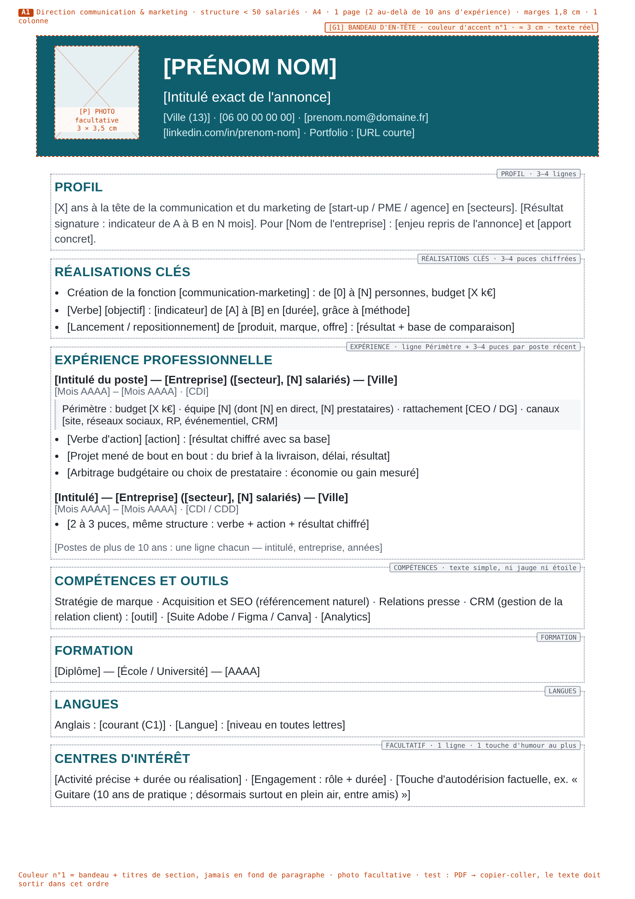
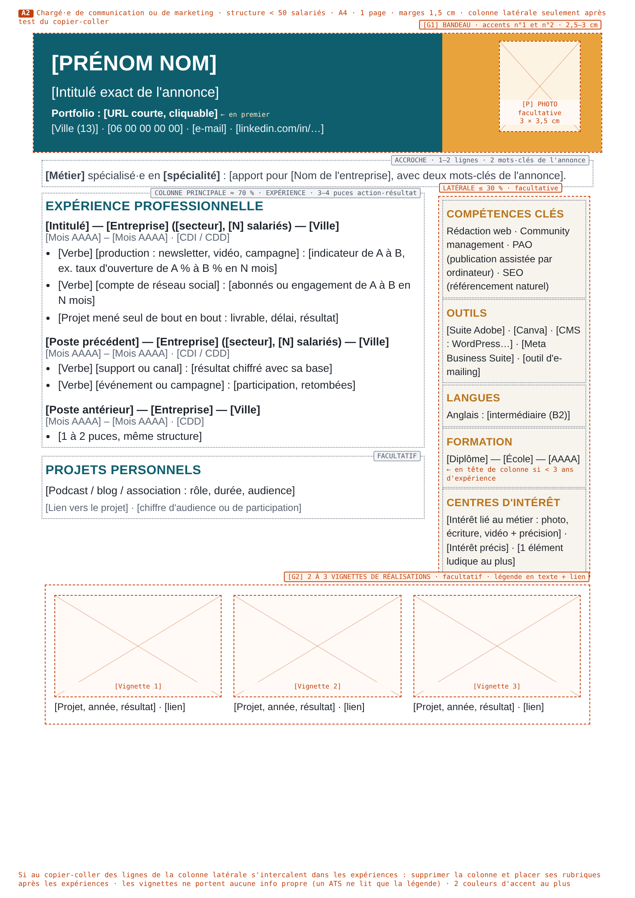
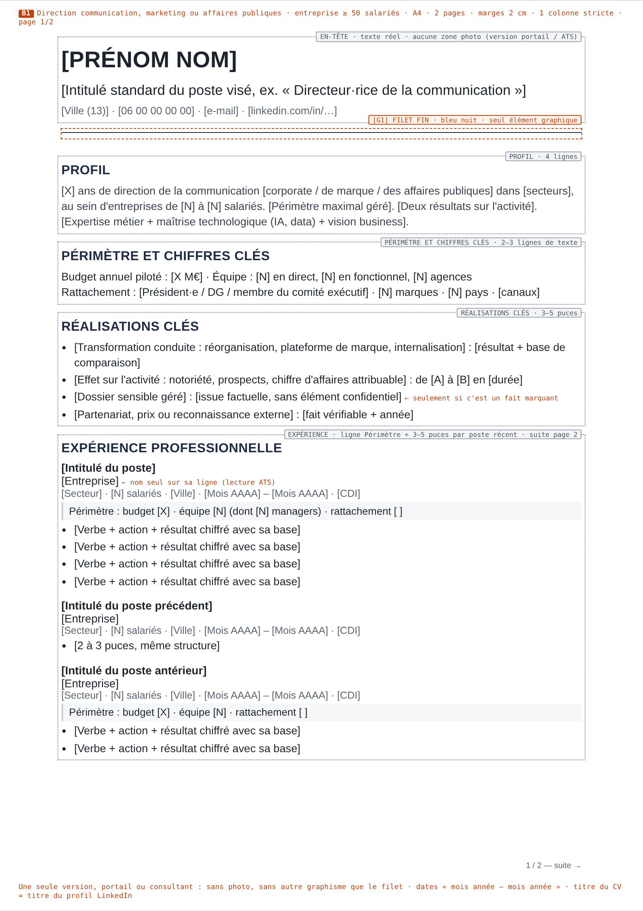
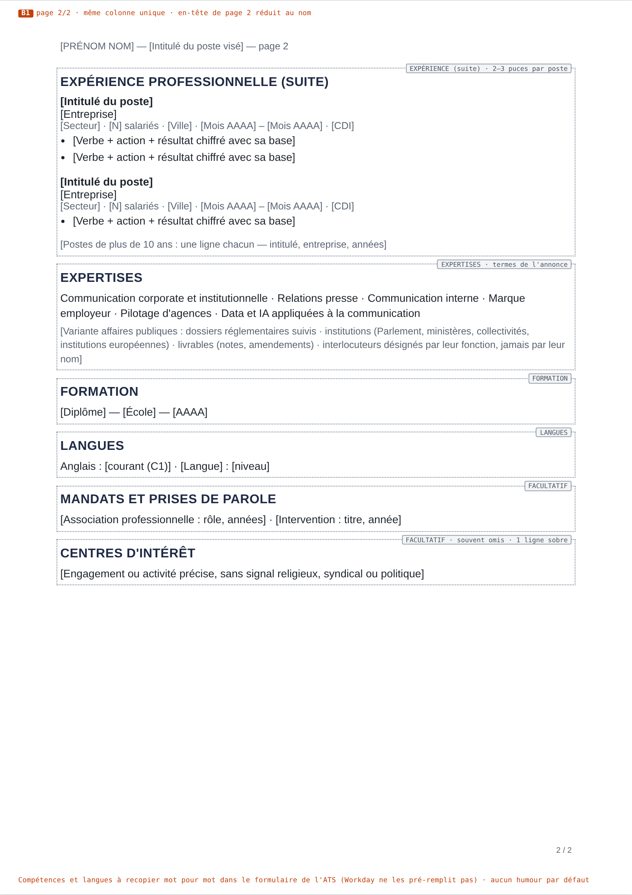
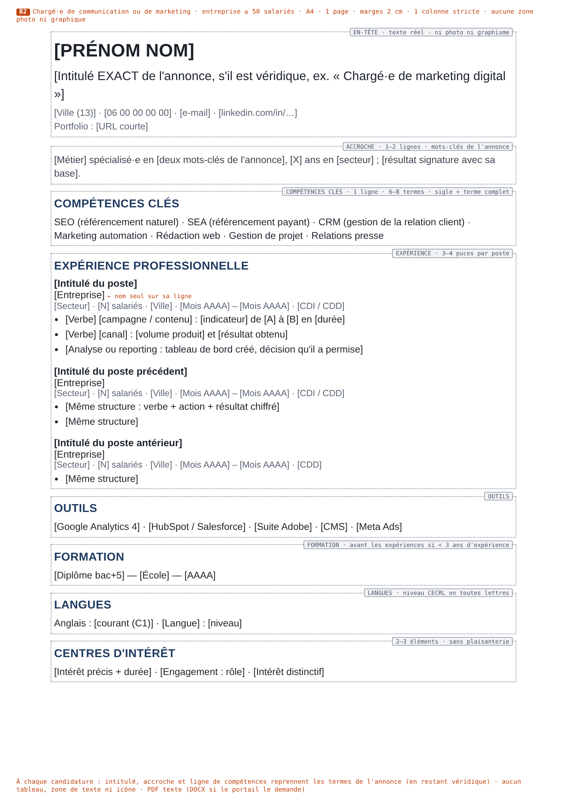
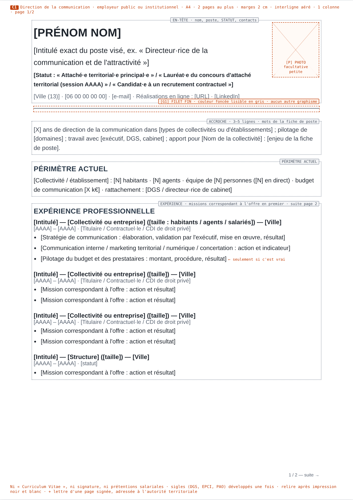
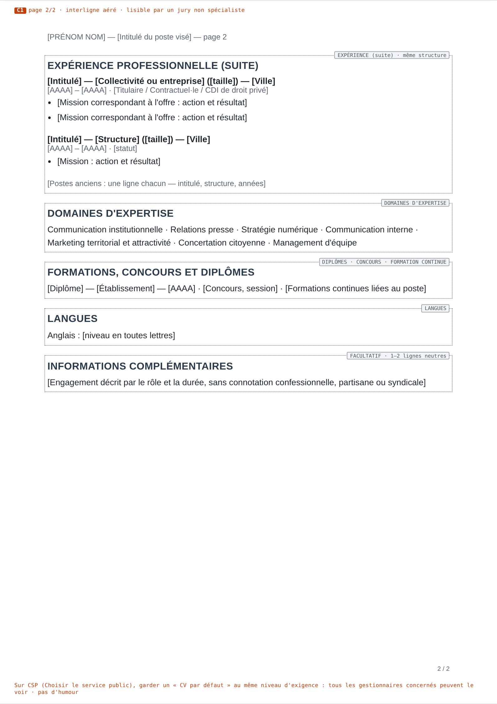
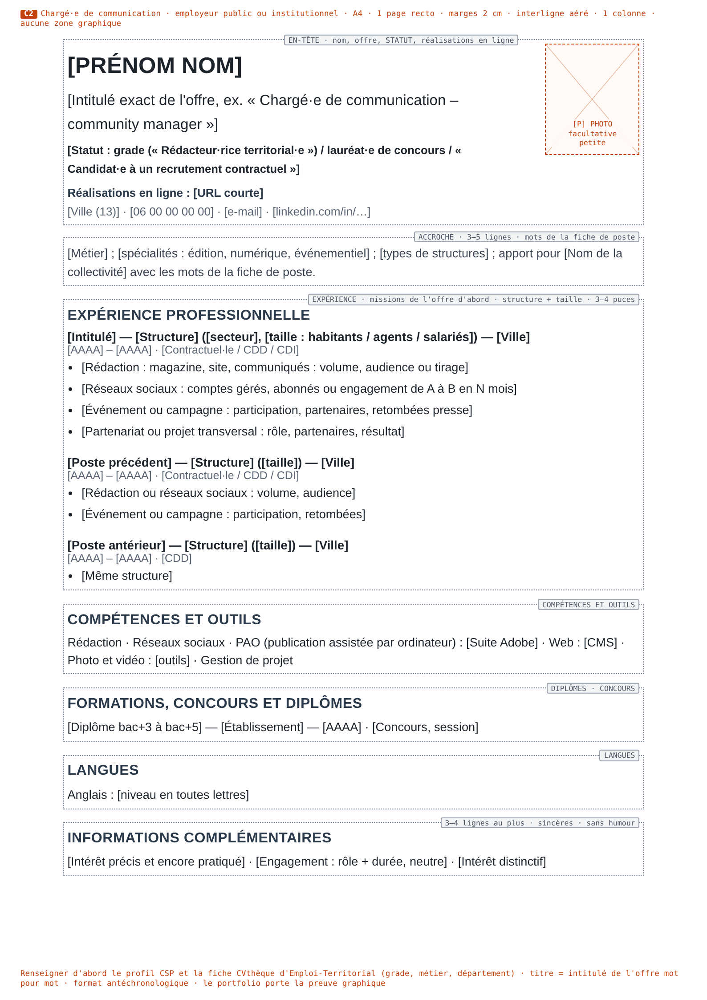

# Un squelette commun porte six CV distincts

Dans les Bouches-du-Rhône, le meilleur CV pour un poste en communication, en affaires publiques ou en marketing (CDI ou CDD) n'est pas six documents différents. C'est un **squelette commun** que l'on module ensuite. Ce squelette tient en quelques règles : du texte réel, une seule colonne de lecture, des intitulés de section standard, des dates complètes, un titre calqué sur l'annonce et des résultats chiffrés accompagnés de leur base de comparaison. On l'adapte ensuite selon trois variables : la présence probable d'un logiciel de tri, l'identité du premier lecteur et le niveau de responsabilité. **H1 n'est vraie qu'en partie.** En 2024, 17 % des PME de 10 à 249 salariés utilisaient un logiciel de recrutement pour leurs cadres, contre 50 % des entreprises de 250 salariés et plus. La vraie rupture se situe vers 250 et surtout 1 000 salariés, pas à 50. Les TPE de moins de 10 salariés, les start-ups et le public ne font l'objet d'aucune mesure. Le secteur public publie ses offres sur une plateforme obligatoire, Choisir le service public, qui repose sur Talentsoft, et sur des outils comme Emploi-Territorial ou le portail Eqwa de la Métropole Aix-Marseille-Provence. Pourtant, aucun des documents lus n'y décrit d'analyse automatique des CV : ce sont des gestionnaires RH, puis des managers et des jurys, qui lisent des PDF. **H2 ne peut être ni confirmée ni infirmée** : aucune étude ne compare les attentes graphiques selon la taille de l'employeur ou selon son statut. La seule expérience contrôlée pénalise l'originalité. Les cadres américains de la publicité et du marketing interrogés préfèrent le format traditionnel. Quant aux guides publics, ils réclament la sobriété, ce qui contredit le « un peu en C ». C'est en A qu'il existe une latitude visuelle : le lecteur est le fondateur et les ATS y sont rares. Cette latitude tient à des touches (un bandeau, une couleur d'accent, un lien vers un portfolio), pas à la structure du CV. Ce qui distingue vraiment les six profils relève du texte. Au niveau 1, il faut un bloc de périmètre (budget, équipe, rattachement). En C, il faut indiquer le statut et la taille des collectivités. En B, il faut reprendre le vocabulaire exact de l'annonce. En A, il faut prouver qu'on sait mener un projet seul, de bout en bout. Aucune source française ne déconseille la rubrique « Centres d'intérêt » pour ces métiers. L'humour n'est défendable qu'en A, en une seule touche d'autodérision.

## Un seul socle est solidement établi : un texte que machine et humain lisent dans le même ordre

Ce rapport synthétise six notes de recherche datées du 8 octobre 2026. Elles portent sur l'adoption et le fonctionnement des ATS, le recrutement public, l'architecture visuelle, l'architecture textuelle, les centres d'intérêt et l'humour, et les spécificités des métiers de la communication. Chaque information porte une marque qui indique son niveau de preuve :

| Marque | Signification |
|---|---|
| (aucune) | source lue par l'équipe de recherche |
| **[NR]** | source que les notes déclarent non relue en entier (résumé de moteur de recherche, extrait, page non ouverte ou inaccessible) ; à revérifier avant tout usage public |
| **[D]** | déduction de l'auteur à partir des sources, et non observation |
| « commercial » | l'émetteur vend des CV, des modèles ou des outils de tri |

Commençons par une conclusion négative, qui pèse sur tout le reste. **Aucune source ne croise les six profils.** Aucune ne décrit ce que les employeurs de Marseille, d'Aix ou de la Métropole attendent d'un CV. La seule base statistique française sérieuse, celle de l'Apec, ne couvre que les recrutements de cadres dans les entreprises privées de 10 salariés et plus. Plusieurs populations échappent donc à toute mesure : les TPE de moins de 10 salariés, les start-ups prises comme catégorie, le secteur public et une bonne partie des postes de chargé·e, qui ne sont souvent pas des postes de cadre. Les études sur la lecture des CV sont américaines, nordiques, anciennes ou produites par des éditeurs de CV. Les recommandations par profil qui suivent sont donc, pour l'essentiel, des déductions argumentées à partir de faits généraux, et elles sont signalées comme telles.

**Premier filtre, l'ATS (logiciel de suivi des candidatures).** La documentation est mince mais cohérente. Le guide d'administration de Workday indique que les résultats de l'analyse automatique (le « parsing ») « can vary based on resume format and order of words ». Il recommande des CV « that don't have images or image-based styles » et précise que les langues et les compétences ne sont pas pré-remplies par cette analyse ([Workday](https://doc.workday.com/admin-guide/en-us/human-capital-management/recruiting/candidates/set-up-prospects-and-candidates/hdc1552497830785.html)) [NR : extraits vus via moteur de recherche]. Textkernel fournit le moteur d'analyse de nombreux ATS. L'éditeur reconnaît qu'au moins **15 % des CV** sont en colonnes. Son nouveau modèle ne repère correctement les séparateurs de colonnes que dans **82 % des cas**, contre 60 % auparavant ([Textkernel](https://textkernel.com/learn-support/blog/improving-extraction-from-column-resumes)). Les tests publiés, tous réalisés par des vendeurs d'outils de CV, montrent que la mise en page sur deux colonnes ne fait pas échouer l'analyse à elle seule. Sur 357 extractions, Enhancv ne mesure qu'un écart de 0,5 point dans la récupération des mots. Mais avec la méthode d'extraction la plus fragile, les sections restent intactes dans 60 % des cas sur une colonne et dans 35 % des cas sur deux ([Enhancv, 2026](https://enhancv.com/blog/two-column-resume-ats-test/), commercial). Resumap conclut que l'ordre dans lequel le fichier livre son texte compte plus que le nombre de colonnes ([Resumap](https://dev.to/resumap/we-ran-the-same-resume-through-4-real-ats-parsers-in-36-layouts-same-text-different-parses-3mfc), commercial). France Travail recommande une seule colonne, aucun tableau ni zone de texte, aucune jauge, des intitulés standard, les mots exacts de l'annonce et des dates écrites en toutes lettres ([France Travail](https://www.francetravail.fr/candidat/vos-recherches/preparer-votre-candidature/cv-lettre-de-motivation-e-mail/logiciels-de-recrutement-ats-ada.html)). Le tableau ci-dessous classe ces règles par solidité. Elles valent pour les six profils, puisqu'un même CV peut un jour être déposé sur un portail.

| Règle commune | Solidité de la preuve | Appui |
|---|---|---|
| Texte réel : PDF exporté d'un traitement de texte, ou DOCX si le portail le demande ; jamais de scan ni d'image du texte | Forte | Workday [NR], [Textkernel](https://developer.textkernel.com/TKPlatform/master/file-formats) [NR] (reconnaissance de texte sur image seulement en option), [SAP](https://userapps.support.sap.com/sap/support/knowledge/en/2081576) [NR] (PNG refusé), France Travail |
| Une colonne de lecture et un ordre linéaire ; toute mise en page à deux zones se teste par copier-coller du PDF dans un éditeur de texte | Mixte | Workday [NR], France Travail ; tests Enhancv et Resumap (commerciaux) [D pour le test] |
| Ni tableau ni zone de texte pour les expériences et les compétences | Faible à moyenne | France Travail ; [Jobmentis](https://www.jobmentis.com/en/guide/resume-parsing) (méthode non détaillée) |
| Ni icône à la place d'un mot, ni jauge ni étoiles ; niveaux écrits en toutes lettres (« Anglais : courant (C1) ») | Faible | Workday [NR], France Travail |
| Dates homogènes « mois année – mois année », jamais « 20xx » | Faible à moyenne | France Travail ; base de connaissances [SAP](https://userapps.support.sap.com/sap/support/knowledge/en/3752154) [NR] |
| Intitulés de section standard (Expérience professionnelle, Formation, Compétences, Langues) | Simple conseil, jamais testé | France Travail |
| Coordonnées dans le corps du document, pas dans l'en-tête Word | Faible, mais sans coût | Blogs tiers, par ex. [jd2cv](https://jd2cv.uk/blog/how-workday-taleo-greenhouse-icims-parse-resumes) ; aucun test isolant ce facteur |

Le rejet automatique massif est un mythe documenté. Le chiffre de « 75 % de CV rejetés par l'ATS » remonte à Preptel, une société de services fermée en 2013, et une consultante RH n'en a trouvé aucune preuve ([HiringThing, 2022](https://blog.hiringthing.com/applicant-tracking-system-myths)). Sur 25 recruteurs américains interrogés par Enhancv, 23 disent que leur système ne rejette automatiquement aucun CV pour sa forme, son contenu ou son design ([Enhancv, 2025](https://enhancv.com/blog/does-ats-reject-resumes/), commercial, échantillon non représentatif). Ce qui filtre vraiment, ce sont les questions éliminatoires et les critères fixés par des humains : le diplôme, ou une interruption de parcours de plus de six mois, motif d'exclusion pour 49 % des entreprises de l'étude Harvard/Accenture ([HBS Working Knowledge](https://www.library.hbs.edu/working-knowledge/how-to-tap-the-talent-automated-hr-platforms-miss) ; [HiringThing](https://blog.hiringthing.com/applicant-tracking-system-myths)). Filtre aussi la recherche par mots-clés que le recruteur lance dans sa base : **83 % des recruteurs équipés** se servent de leur logiciel pour trier les candidatures ([Apec, 2017](https://corporate.apec.fr/files/live/sites/corporate/files/Nos%20%C3%A9tudes/pdf/Les%20progiciels%20de%20recrutement%20en%202016%20-%20quel%20equipement%20-%20quels%20usages.pdf)). Le vrai risque d'un CV mal construit n'est donc pas le rejet par une machine. C'est d'être mal lu par elle, puis de rester introuvable.

**Deuxième filtre, la lecture RH, qui est un balayage.** L'étude par suivi du regard (oculométrie) de TheLadders mesure 7,4 secondes de tri initial aux États-Unis. Les CV bien notés ont une mise en page simple, des titres en gras et des réalisations à puces ; les colonnes multiples et l'encombrement sont pénalisés ([HR Dive, 2018](https://www.hrdive.com/news/eye-tracking-study-shows-recruiters-look-at-resumes-for-7-seconds/541582/), étude d'origine non lue). La seule mesure française a été publiée par un éditeur de CV. Elle donne **53 secondes** de lecture moyenne. Le regard part de l'intitulé du poste (premier élément regardé pour 44 % des recruteurs), passe à l'accroche puis descend le long de la marge gauche ([CVprofessionnel via Tendance Hôtellerie, 2020](https://www.tendancehotellerie.fr/articles-breves/communique-de-presse/14431-article/enquete-cvprofessionnel-les-recruteurs-lisent-ils-vraiment-les-cv-des-candidats), commercial, communiqué en partie contradictoire). La personne qui fait ce balayage dépend de la taille de l'entreprise : un service RH existe dans **29 % des TPE, 67 % des PME et 92 % des ETI et grandes entreprises**. Selon l'Apec, les RH « se doivent de comprendre les besoins des managers pour réaliser un 1er filtrage des CV de qualité » ([Apec, 2022](https://corporate.apec.fr/files/live/sites/corporate/files/Nos%20%C3%A9tudes/pdf/le-role-des-managers-dans-les-recrutements)). Ce lecteur vérifie la conformité du CV : l'intitulé, les dates, l'ancienneté, le diplôme, la cohérence du parcours [D].

**Troisième filtre, la lecture experte, qui juge la crédibilité métier.** Les managers trouvent l'évaluation des compétences techniques moins difficile que les RH ou les dirigeants (24 % contre 36 %). Ils sont aussi les principaux décideurs à chaque étape : de 45 % des cas pour la sélection des candidats à 62 % pour l'évaluation technique ([Apec, 2025](https://corporate.apec.fr/files/live/sites/corporate/files/Nos%20etudes/PDF/Regard%20des%20recruteurs%20sur%20le%20recrutement%20de%20cadres.pdf)). En communication, les professionnels interrogés placent la rédaction (18 %) en tête des savoir-faire, devant les réseaux sociaux et la gestion de projet (17 % chacun) ([Sup'de Com/OpinionWay, 2026](https://www.blogdumoderateur.com/guides/barometre-2026-metiers-communication-recruteurs-attendent-vraiment/), contenu sponsorisé par une école). Une autre enquête place pourtant les qualités relationnelles (64 %) très loin devant la maîtrise des outils (8 %) ([COM-ENT/Occurrence via CB News, 2023](https://www.cbnews.fr/node/73916)). La tolérance aux fautes d'orthographe est plus faible pour les métiers d'écriture et de visibilité, community managers compris ([Welcome to the Jungle, 2021](https://www.welcometothejungle.com/fr/articles/recrutement-accepter-les-fautes-d-orthographe)). Le portfolio n'est en général consulté qu'après la présélection ([France Travail](https://www.francetravail.fr/candidat/vos-recherches/preparer-votre-candidature/cv-lettre-de-motivation-e-mail/3-raisons-davoir-un-portfolio-pr.html)). La DRH de BETC Digital résume ce partage des rôles : « Le CV n'est qu'une porte d'entrée, le book est là pour prouver ce qu'il y a dans le CV » ([L'Étudiant, 2017](https://www.letudiant.fr/jobsstages/le-cv-graphique-pour-qui.html)). Au niveau 1, ce troisième lecteur n'est pas un responsable de la communication. C'est le dirigeant, le comité de direction, un cabinet de recrutement ou, dans le public, le directeur général des services (DGS), le directeur de cabinet et l'élu [D].

## H1 n'est vraie qu'aux extrêmes, pas au seuil de 50 salariés ; H2 ne repose sur aucune mesure

**H1 est confirmée pour l'écart entre les petites et les très grandes entreprises, mais pas au seuil de 50 salariés.** En 2016, l'Apec mesurait la part d'entreprises équipées d'un logiciel de recrutement selon leur taille :

| Taille de l'entreprise | Part équipée (2016) |
|---|---|
| moins de 100 salariés | 13 % |
| 100 à 249 | 18 % |
| 250 à 499 | 26 % |
| 500 à 999 | 34 % |
| 1 000 à 4 999 | 65 % |
| 5 000 et plus | 68 % |

L'Apec note que « la césure est très forte à partir de 1 000 salariés » ([Apec, 2017](https://corporate.apec.fr/files/live/sites/corporate/files/Nos%20%C3%A9tudes/pdf/Les%20progiciels%20de%20recrutement%20en%202016%20-%20quel%20equipement%20-%20quels%20usages.pdf)). En 2024, **17 % des PME de 10 à 249 salariés** utilisaient un logiciel de recrutement pour leurs cadres, contre **50 % des entreprises de 250 salariés et plus**. Dans les PME, 83 % s'en tenaient à la bureautique. La part d'ATS dédié serait de 13 % contre 35 %, d'après un graphique lu par extraction de texte et non vérifié à l'œil ([Apec, 2025](https://corporate.apec.fr/files/live/sites/corporate/files/Nos%20etudes/PDF/Pratiques%20de%20recrutement%202025.pdf)). Aucune édition ne permet d'observer le seuil de 50 salariés. La catégorie B réunit des entreprises de 50 à 249 salariés, aussi peu équipées que celles de A, et des groupes du CAC 40. Dans ces groupes, un décompte indépendant trouve Workday chez 12 groupes sur 40, puis iCIMS, Oracle-Taleo et SAP SuccessFactors chez 7 groupes chacun ([Laurent Brouat, 2026](https://lestalentsnarratifs.substack.com/p/outil-inconnu-pour-ats), décompte partiel, tableau de synthèse non lu). Il faut donc lire B comme deux populations : **B-moyen (50 à 249 salariés)** et **B-grand (1 000 salariés et plus)** [D]. Être équipé ne veut pas dire utiliser son outil : 30 % des entreprises équipées ne s'en étaient pas servies pour leur dernier recrutement de cadre ([Apec, 2017](https://corporate.apec.fr/files/live/sites/corporate/files/Nos%20%C3%A9tudes/pdf/Les%20progiciels%20de%20recrutement%20en%202016%20-%20quel%20equipement%20-%20quels%20usages.pdf)). À l'étranger, l'équipement commence plus bas. Dans l'étude Harvard/Accenture (États-Unis, Royaume-Uni, Allemagne), plus de la moitié des entreprises de 50 à 999 salariés utilisent intensivement des logiciels de filtrage ([HBS Working Knowledge, 2021](https://www.library.hbs.edu/working-knowledge/how-to-tap-the-talent-automated-hr-platforms-miss), article lu, rapport primaire non ouvert). Ce chiffre ne mesure pas la France ; il indique seulement le niveau vers lequel elle pourrait évoluer [D].

Trois populations restent hors mesure. Aucune donnée ne chiffre l'équipement des TPE de moins de 10 salariés, ni celui des start-ups. En 2016, l'informatique et l'ingénierie étaient plus équipées que la moyenne (35 à 40 % contre 27 %) ([Apec, 2017](https://corporate.apec.fr/files/live/sites/corporate/files/Nos%20%C3%A9tudes/pdf/Les%20progiciels%20de%20recrutement%20en%202016%20-%20quel%20equipement%20-%20quels%20usages.pdf)). Il est donc plausible que les start-ups technologiques soient équipées, sans que rien le démontre. Les taux d'équipement des PME qui circulent sur des sites d'éditeurs, de 20 % à 68 %, n'ont pas de source et se contredisent. La page de France Travail qui attribue à « l'Apec 2025 » un taux de 27 % reprend en réalité les données de 2016 ([France Travail](https://www.francetravail.fr/candidat/vos-recherches/preparer-votre-candidature/cv-lettre-de-motivation-e-mail/logiciels-de-recrutement-ats-ada.html)). Pour le secteur public, cette partie de H1 doit être reformulée. Le public est bien « équipé » : toute création ou vacance d'emploi permanent doit être publiée sur Choisir le service public (CSP). Cette plateforme se définit comme un « SI de recrutement » et s'appuie sur un back-office Talentsoft ([CSP, guide du gestionnaire RH, 2024](https://choisirleservicepublic.gouv.fr/wp-content/uploads/2026/03/CSP-Guide-candidatures.pdf)). Mais **aucun des guides lus ne décrit de lecture automatique, de score ni d'appariement automatique (« matching ») entre CV et offre**. Les CV s'ouvrent dans une visionneuse, le « Document Reader ». Des gestionnaires RH les analysent, puis les transmettent au manager pour avis. Le seul filtre structuré documenté porte sur des champs du profil (grade, métier, département) dans la CVthèque d'Emploi-Territorial ([guide Emploi-Territorial, 2025](https://www.emploi-territorial.fr/col/data/guide_col.pdf)). Le tri des candidatures par IA n'apparaît que parmi les usages « envisageables » de la stratégie de la DGAFP ([DGAFP, 2024](https://www.fonction-publique.gouv.fr/files/files/publications/publications-dgafp/guide-strategie-usage-intelligence-artificielle.pdf)). Limite : les images des diapositives des guides CSP n'ont pas été examinées.

**H2 n'est ni confirmée ni infirmée par une mesure.** Aucune étude, française ou étrangère, ne compare les attentes graphiques selon la taille de l'employeur, ni entre public et privé. Les preuves disponibles distinguent les métiers, pas les tailles d'entreprise. La seule expérience contrôlée publiée dans une revue à comité de lecture a été menée en Norvège sur un poste générique. Toute déviation du format formel y réduit les chances d'entretien, et le format « créatif » obtient presque deux fois moins de convocations ([Arnulf et al., 2010, via ScienceNorway](https://partner.sciencenorway.no/bi-forskningno-job/thumbs-down-for-creative-rsums/1374873)). En 2016, **78 % des cadres américains de la publicité et du marketing** préféraient un CV traditionnel ; la préférence pour l'infographie était tombée de 20 % en 2013 à 3 % ([Robert Half/The Creative Group, 2016](https://press.roberthalf.com/2016-05-05-The-Best-Resumes-Get-Back-To-The-Basics)). Une enquête danoise auprès de 1 002 entreprises place en tête le CV « modérément graphique » ([Aalborg University, 2023](https://students.aau.dk/the-cv-what-do-the-companies-say-n55492)). En France, les seuls avis nommés datent de 2017. Jean-Eudes Yahouedeou, de Seeqle (commercial), affirme : « Dès qu'on demande des compétences visuelles, ça doit a minima se voir sur le CV », tout en ajoutant qu'« il faut que ça reste dans les codes de votre secteur » ([L'Étudiant, 2017](https://www.letudiant.fr/jobsstages/le-cv-graphique-pour-qui.html)).

**Pour A, H2 est plausible mais non démontrée.** Le lecteur est souvent le fondateur et l'ATS y est rare. Licorne Society, acteur du recrutement en start-up, recommande un CV « reflet de la personne que vous êtes » ([Licorne Society, 2025](https://www.licornesociety.com/blog/10-conseils-cv-startup), commercial). Welcome to the Jungle admet aussi une accroche plus décalée qu'en multinationale ([Welcome to the Jungle, 2021](https://www.welcometothejungle.com/fr/articles/phrase-accroche-cv-demarquer)). Mais même une talent manager de start-up cherche les mots-clés du poste dans le CV ([Welcome to the Jungle, 2022](https://www.welcometothejungle.com/fr/articles/cv-classique-simple-efficace-emploi)), et la pénalité mesurée par Arnulf vaut pour tous les employeurs. **Pour C, le « un peu » de H2 est contredit par les seules sources disponibles.** Le centre de gestion de l'Ariège demande d'éviter « un surplus de couleurs » et de rester « sobre au niveau de la présentation » ([CDG 09, 2024](https://cdg09.fr/wp-content/uploads/2024/01/25_autre_rediger_un_cv.pdf)). Celui de la Gironde demande de vérifier le rendu des couleurs après impression ([CDG 33, 2024](https://www.cdg33.fr/wp-content/uploads/ressources/2024_GUIDE_RECHERCHE_EMPLOI_CEP.pdf)). Le seul signal officiel en faveur du visuel pour la communication publique place la preuve hors du CV : selon Choisir le service public, une « réalisation sur internet peut être un atout » pour les emplois de la communication ([CSP, guide candidats, 2024](https://choisirleservicepublic.gouv.fr/wp-content/uploads/2024/10/Guide-candidats.pdf)). Conclusion pratique [D] : la latitude graphique est maximale en A et décroît vers B-grand et C. Ces deux derniers aboutissent à la même sobriété, mais pour des raisons différentes : le logiciel de tri d'un côté, les consignes et l'impression de l'autre. Dans tous les cas, cette latitude se joue dans les touches visuelles, pas dans la structure du CV.

## Partie 1 — Six profils, de A1 à C2 : ce qui change vraiment d'un profil à l'autre

Chaque profil suit la même grille en six points. Pour éviter les redites, les faits communs exposés plus haut ne sont repris que lorsqu'ils modifient la recommandation. Les repères typographiques figurent une seule fois, en A1, et valent pour tous les profils sauf mention contraire. Un cabinet de conseil en affaires publiques de moins de 50 salariés relève de A ; le service des affaires publiques d'un grand groupe relève de B. Le type de contrat ne modifie pas l'architecture : aucune source ne documente de différence de format entre CDI et CDD, et l'Apec relevait seulement, en 2016, un peu plus de candidatures par offre de cadre en CDI (41) qu'en CDD (36) ([Apec, 2018](https://corporate.apec.fr/files/live/sites/corporate/files/Nos%20%C3%A9tudes/pdf/Offre-au-recrutement-candidatures-sur-offre-2018.pdf)). Dans le public, un CDD correspond le plus souvent à un recrutement contractuel, ce qui rend la ligne de statut d'autant plus utile [D].

### A1 — Diriger la communication d'une petite structure : convaincre un fondateur, pas un logiciel

#### 1. Compatibilité ATS et ATS probables

Le CV d'un A1 a de bonnes chances de ne passer par aucun ATS. En 2024, **83 % des PME de 10 à 249 salariés** recrutaient leurs cadres avec la seule bureautique ([Apec, 2025](https://corporate.apec.fr/files/live/sites/corporate/files/Nos%20etudes/PDF/Pratiques%20de%20recrutement%202025.pdf)). En 2025, le réseau et la cooptation ont permis **28 % des recrutements de cadres dans les PME**, contre 13 % dans les entreprises plus grandes. Par ailleurs, 41 % des PME ont recruté des cadres déjà connus ou recommandés, et l'approche directe (la chasse) a finalisé 11 % des recrutements de cadres en PME ([Apec, 2026](https://corporate.apec.fr/files/live/sites/corporate/files/Nos%20etudes/PDF/Pratiques%20de%20recrutement%20de%20cadres%202026.pdf)). Aucune donnée ne couvre les structures de moins de 10 salariés. Quand une petite structure s'équipe, c'est plutôt d'un ATS par abonnement : Flatchr, Taleez, Recruitee, Beetween, Teamtailor, Welcome Kit, Factorial. Cette liste vient d'une cartographie de cabinet de conseil, sans chiffres sourcés ([Auxine Partners, 2026](https://www.auxinepartners.com/insights/le-marche-des-ats-en-france-cartographie-dun-secteur-en-pleine-consolidation)). Le module de candidature des sites d'offres d'emploi (job boards) joue probablement le rôle d'ATS, mais aucune source ne le documente. Les exigences connues de ces outils sont légères. Recruitee analyse les PDF, Word et ODT ; le recruteur vérifie et corrige chaque champ extrait, avec le CV d'origine sous les yeux ([Recruitee](https://support.recruitee.com/en/articles/1109254-upload-and-parse-cvs)). Flatchr propose un classement automatique des candidatures selon leur proximité avec l'offre, sans donnée sur son usage réel ([Flatchr](https://www.flatchr.io/en/cv-matching-ai-flatchr-fit)). En pratique [D], un PDF texte sur une colonne suffit. L'enjeu ATS est faible. L'enjeu de transmission est réel : le CV circule par courriel entre le fondateur, un associé et parfois un cabinet. Il faut donc nommer le fichier de façon explicite (« NOM_Prenom_Directeur-communication.pdf ») et aligner le titre du profil LinkedIn sur celui du CV, comme le recommande Michael Page ([Michael Page, 2024](https://www.michaelpage.fr/advice/candidats/le-cv-et-la-lettre-de-motivation/les-dix-commandements-du-cv)).

#### 2. Architecture visuelle

C'est un des deux profils où la latitude graphique est la plus grande, même si elle n'est pas démontrée (voir H2). Proposition [D] : une seule colonne de lecture, un bandeau d'en-tête dans une couleur d'accent, une seconde couleur au plus, des titres de section en gras. Le bandeau fait partie du corps du document : il ne doit pas être placé dans la zone « en-tête » de Word. **Longueur** : une page jusqu'à dix ans d'expérience, deux au-delà. Licorne Society énonce cette norme pour les start-ups ([Licorne Society, 2025](https://www.licornesociety.com/blog/10-conseils-cv-startup), commercial). Elle est cohérente avec Michael Page, qui admet deux à trois pages pour un profil expérimenté ([Michael Page, 2024](https://www.michaelpage.fr/advice/candidats/le-cv-et-la-lettre-de-motivation/les-dix-commandements-du-cv)). Une simulation américaine trouve que l'avantage du CV de deux pages croît avec le niveau : les recruteurs le choisissent 1,4 fois plus souvent pour un débutant et 2,9 fois plus souvent pour un manager ([ResumeGo, 2018](https://www.resumego.net/research/one-or-two-page-resumes/), commercial ; dans cette étude, longueur et quantité d'information varient ensemble). **Photo** : facultative. Aucune donnée française ne mesure son effet. Le Défenseur des droits rappelle qu'exiger une photo « ne peut être qu'exceptionnel » et recommande aux recruteurs de la retirer au moment du tri ([Défenseur des droits, 2019](https://www.defenseurdesdroits.fr/sites/default/files/2023-03/DDD_guide_recrutement-sans-discrimination_20190703.pdf)). Si elle figure, elle reste petite et professionnelle [D]. **Typographie, repères valables pour les six profils** : une police standard, de préférence sans empattement pour la lecture à l'écran. France Travail cite Arial, Calibri, Helvetica, Times et Garamond ([France Travail](https://www.francetravail.fr/candidat/vos-recherches/preparer-votre-candidature/cv-lettre-de-motivation-e-mail/logiciels-de-recrutement-ats-ada.html)). Un chercheur de l'université d'Aalborg note que les polices sans empattement comme Arial et Calibri fonctionnent bien à l'écran ([Videnskab.dk, 2025](https://videnskab.dk/kultur-samfund/vil-du-til-samtale-saadan-fanger-dit-cv-arbejdsgiverens-blik/)). Pour les tailles, les seuls repères chiffrés viennent de guides universitaires américains vus par résumé : nom en 18 à 24 pt, titres de section en 12 à 14 pt, corps de texte en 10 à 12 pt ([Berkeley iSchool](https://www.ischool.berkeley.edu/careers/guides/resume) [NR]), et pas moins de 11 pt pour gagner de la place ([MIT Communication Lab](https://mitcommlab.mit.edu/cee/commkit/cv-resume/) [NR]). Ce sont des usages de conseil, pas des résultats de recherche. **Densité** : un profil de moins de huit lignes, puisque neuf entreprises danoises sur dix n'en veulent pas davantage ([Aalborg University, 2023](https://students.aau.dk/the-cv-what-do-the-companies-say-n55492)). Pour chaque poste récent, trois à quatre points, comme le décrit une talent manager de start-up ([Welcome to the Jungle, 2022](https://www.welcometothejungle.com/fr/articles/cv-classique-simple-efficace-emploi)).

#### 3. Architecture textuelle

Ordre proposé [D], qui suit l'ordre de lecture mesuré (titre, accroche, puis marge gauche) et l'ordre classique de Michael Page :

1. titre reprenant l'intitulé de l'annonce ;
2. accroche de trois à quatre lignes qui donne l'envergure, un résultat signature et le nom de l'entreprise visée ;
3. bloc de trois ou quatre « Réalisations clés » ;
4. expériences dans l'ordre antéchronologique, chacune ouverte par une ligne de périmètre ;
5. compétences et outils ;
6. formation ;
7. langues ;
8. centres d'intérêt.

L'accroche qui nomme l'entreprise et reprend les mots de l'annonce est un conseil de Mohamed Achahbar, recruteur et formateur ([Welcome to the Jungle, 2021](https://www.welcometothejungle.com/fr/articles/phrase-accroche-cv-demarquer)). **Part des chiffres** : aucune proportion entre chiffres et récit n'est sourcée, et en inventer une serait trompeur. Le seul modèle explicite est celui de Laszlo Bock, alors DRH de Google : « Accomplished [X] as measured by [Y], by doing [Z] ». Le chiffre doit y être accompagné de sa base de comparaison ([Business Insider, 2014](https://www.businessinsider.in/google-hr-boss-says-this-is-the-key-to-a-perfect-resume/articleshow/43924179.cms), billet d'origine non ouvert). Règle de travail [D] : au moins une mesure avec sa base par poste récent. Au niveau 1, ces mesures décrivent l'échelle (budget, équipe, canaux) et l'effet sur l'activité (notoriété, prospects qualifiés, chiffre d'affaires attribuable). Licorne Society conseille d'ailleurs aux managers de citer la taille de leur équipe et aux marketeurs la croissance du trafic ([Licorne Society, 2025](https://www.licornesociety.com/blog/10-conseils-cv-startup)). Attention cependant : dans l'enquête française de CVprofessionnel, les recruteurs ne classent « résultats et distinctions » qu'au 7e rang sur 12, loin derrière la clarté de la mise en page ([CVprofessionnel, 2020](https://www.tendancehotellerie.fr/articles-breves/communique-de-presse/14431-article/enquete-cvprofessionnel-les-recruteurs-lisent-ils-vraiment-les-cv-des-candidats), commercial). **Registre** : direct et incarné. L'accroche peut avoir du style : Welcome to the Jungle admet un ton plus décalé en start-up que dans une multinationale. Les puces restent factuelles et commencent par un verbe d'action, pas par « je » ([Michael Page, 2024](https://www.michaelpage.fr/advice/candidats/le-cv-et-la-lettre-de-motivation/les-dix-commandements-du-cv)). Le formalisme est faible, mais une seule faute d'orthographe peut suffire à faire écarter un CV ([Licorne Society, 2025](https://www.licornesociety.com/blog/10-conseils-cv-startup)). **RH et lecteur expert** : en A1, le filtre RH manque souvent, puisque seules 29 % des TPE et 67 % des PME ont un service RH ([Apec, 2022](https://corporate.apec.fr/files/live/sites/corporate/files/Nos%20%C3%A9tudes/pdf/le-role-des-managers-dans-les-recrutements)). Le premier lecteur est donc le fondateur, qui lit en décideur. Il cherche [D] la capacité à bâtir une fonction à partir de rien, à faire beaucoup avec un petit budget, à cumuler communication, marketing et parfois marque employeur, et à mener des projets de bout en bout. Pour les postes de manager, 76 % des recruteurs prennent des références au moins de temps en temps et 71 % organisent des entretiens à plusieurs ([Apec, 2024](https://corporate.apec.fr/files/live/sites/corporate/files/Nos%20etudes/PDF/Recrutements%20de%20cadres%20managers.pdf)). Toute taille d'équipe annoncée sera donc vérifiée : il faut distinguer les liens hiérarchiques et les liens fonctionnels.

#### 4. Sources

| Source | Statut | Apport pour A1 |
|---|---|---|
| Apec, *Pratiques de recrutement 2025* et *de cadres 2026* ([2025](https://corporate.apec.fr/files/live/sites/corporate/files/Nos%20etudes/PDF/Pratiques%20de%20recrutement%202025.pdf), [2026](https://corporate.apec.fr/files/live/sites/corporate/files/Nos%20etudes/PDF/Pratiques%20de%20recrutement%20de%20cadres%202026.pdf)) | Lues ; cadres, entreprises de 10 salariés et plus | Bureautique dominante, poids du réseau en PME |
| Apec, *Le rôle des managers dans les recrutements*, nov. 2022 ([lien](https://corporate.apec.fr/files/live/sites/corporate/files/Nos%20%C3%A9tudes/pdf/le-role-des-managers-dans-les-recrutements)) | Lue | Présence d'un service RH selon la taille |
| André Farah, Licorne Society, 16 mai 2025, mis à jour le 17 nov. 2025 ([lien](https://www.licornesociety.com/blog/10-conseils-cv-startup)) | Lue ; commerciale | Longueur, chiffres, ton personnel, orthographe |
| Caroline Roux / M. Achahbar, Welcome to the Jungle, 21 sept. 2021 ([lien](https://www.welcometothejungle.com/fr/articles/phrase-accroche-cv-demarquer)) | Lue | Accroche, ton plus décalé en start-up |
| Auxine Partners, 9 févr. 2026 ([lien](https://www.auxinepartners.com/insights/le-marche-des-ats-en-france-cartographie-dun-secteur-en-pleine-consolidation)) | Lue ; affirmations non sourcées | Liste des ATS du segment PME |
| Apec, *Recrutements de cadres managers*, nov. 2024 ([lien](https://corporate.apec.fr/files/live/sites/corporate/files/Nos%20etudes/PDF/Recrutements%20de%20cadres%20managers.pdf)) | Lue | Références et entretiens à plusieurs pour les managers |

**Rareté** : aucune source ne traite du CV d'un directeur de la communication en TPE ou en start-up, et aucune ne porte sur les Bouches-du-Rhône.

#### 5. Ce qui distingue A1 des cinq autres profils

A1 est le seul profil où le premier lecteur est presque toujours un décideur non RH qui juge l'effet sur l'activité de l'entreprise. Il diffère d'A2 par le bloc de périmètre et de réalisations, par une longueur qui peut atteindre deux pages et par l'absence de vignettes de réalisations. Il diffère de B1 par l'absence de contrainte ATS forte, par un registre plus personnel et par la valeur donnée à la polyvalence plutôt qu'à la spécialisation. Il diffère de C1 par l'absence de ligne de statut et de taille de collectivité, par une neutralité moins contraignante et par une touche graphique admise [D].

#### 6. Centres d'intérêt

**Rubrique facultative.** Si elle est conservée, elle compte un à trois éléments sur une seule ligne. **L'humour est jouable, en une seule touche.** Aucune source française ne déconseille la rubrique pour ce profil. HelloWork juge que « l'humour est acceptable » et donne l'exemple d'un guitariste qui ne joue plus qu'à la plage avec des amis ([HelloWork, 2026](https://www.hellowork.com/fr-fr/medias/cv-centres-interet.html)). Licorne Society juge qu'en start-up une touche d'humour est appréciée, sans abus ([Licorne Society, 2025](https://www.licornesociety.com/blog/10-conseils-cv-startup), commercial). La seule expérience solide sur l'humour porte sur l'oral, pas sur le CV. Elle montre une asymétrie : une plaisanterie appropriée qui tombe à plat ne coûte presque rien (statut perçu de 3,68 contre 4,07 pour une réponse sérieuse, écart non significatif), alors qu'une plaisanterie inappropriée coûte cher (2,97) ([Bitterly, Brooks et Schweitzer, 2017](https://faculty.wharton.upenn.edu/wp-content/uploads/2017/03/2016-54537-001.pdf)). Sur un CV, personne ne rit en retour pour confirmer que la plaisanterie a porté. D'où la règle de dosage [D] : un élément sur trois au plus, en autodérision factuelle, compréhensible sans contexte, sans cible ni tabou. Deux arguments plaident pour omettre la rubrique à ce niveau, sans le démontrer. En 2011, un recruteur de l'industrie voulait la voir « éradiquée » ([L'Étudiant, 2011](https://www.letudiant.fr/jobsstages/lettres-de-motivation_1/recherche-demploi-les-recruteurs-lisent-il-le-bas-du-cv-17516.html)). À l'étranger, 90 % des rédacteurs professionnels de CV (pas des recruteurs) la suppriment au-delà de cinq ans d'expérience ([ResumeLab via Fuzu, 2021](https://www.fuzu.com/forum/article/survey-500-recruiters-reveal-what-they-look-for-in-a-resume)). En sens inverse, Michael Page juge pour les cadres expérimentés qu'elle « a son importance » pour « créer du lien » ([Michael Page, 2026](https://www.michaelpage.fr/advice/candidats/le-cv-et-la-lettre-de-motivation/quel-cv-pour-un-cadre-exp%C3%A9riment%C3%A9)).

### A2 — Chargé·e dans une petite structure : le CV sert déjà d'échantillon de travail

#### 1. Compatibilité ATS et ATS probables

Les données d'équipement sont les mêmes qu'en A1, mais elles s'appliquent encore moins bien. L'Apec ne mesure que les recrutements de cadres, et beaucoup de postes de chargé·e de communication ne sont pas des postes de cadre ; aucune source ne donne leur part. Les candidatures passent vraisemblablement par les sites d'offres d'emploi et la messagerie [D]. Quand la structure a un ATS de PME, l'analyse automatique est vérifiée par un humain (Recruitee) ou permet des imports par lots avec correction avant enregistrement ([Teamtailor](https://www.teamtailor.com/en/productnews/parse-candidates-faster-and-easier/)). La petite taille ne dispense pas des mots-clés. « Camille », talent manager en start-up, le dit : « nous avons les mots-clés du poste, et nous allons chercher si le CV du candidat les contient aussi » ([Welcome to the Jungle, 2022](https://www.welcometothejungle.com/fr/articles/cv-classique-simple-efficace-emploi)). Exigence pratique : reprendre l'intitulé de l'annonce et ses termes métier en toutes lettres.

#### 2. Architecture visuelle

C'est le profil où la compétence visuelle fait le plus partie du poste. La règle de Yahouedeou s'y applique le mieux : si le poste demande des compétences visuelles, cela doit se voir sur le CV ([L'Étudiant, 2017](https://www.letudiant.fr/jobsstages/le-cv-graphique-pour-qui.html), commercial). Proposition [D], dans le registre « modérément graphique » qui recueille le plus d'adhésion au Danemark :

- un bandeau d'en-tête en couleur ;
- une ou deux couleurs d'accent ;
- en option, une colonne latérale étroite (30 % de la largeur au plus) pour les compétences, les outils et les langues ;
- en option, une ligne de deux ou trois vignettes de réalisations, chacune légendée en texte et liée au portfolio.

La colonne latérale n'est admise qu'après un test : un copier-coller du PDF doit restituer la colonne principale d'un seul tenant, sans lignes entremêlées. Ce test s'impose aussi pour un CV conçu dans Canva. Un vendeur de vérificateur ATS a constaté que des exports Canva à deux colonnes sortaient en texte mélangé dans Workday, et qu'un PDF image ne livrait aucun texte ([ATS Verification, 2026](https://atsverification.com/blog/workday-pdf-resume-parsing/), commercial). L'histoire de « calques invisibles » dans Canva, rapportée par le Journal du Net, n'a pas été vérifiée par un test ([JDN, 2025](https://www.journaldunet.com/management/emploi-cadres/1537223-cd1-cv-rejet/)). Les vignettes ne portent jamais l'information seules : un logiciel n'en lit que la légende [D]. **Longueur** : une page ([Michael Page, 2024](https://www.michaelpage.fr/advice/candidats/le-cv-et-la-lettre-de-motivation/les-dix-commandements-du-cv)). **Photo** : facultative, comme en A1. **Typographie et densité** : repères d'A1 ; un corps de 10 à 11 pt suffit sur une page [D].

#### 3. Architecture textuelle

Ordre proposé [D] :

1. titre identique à l'intitulé de l'annonce, coordonnées et lien vers le portfolio en haut de page ;
2. accroche d'une à deux lignes qui nomme l'entreprise ;
3. compétences clés ;
4. expériences, avec trois à quatre puces action-résultat par poste ;
5. projets personnels, facultatifs ;
6. outils ;
7. formation, placée plus haut pour un profil junior ou si le diplôme est lié au poste, comme le conseille Emploipublic ;
8. langues ;
9. centres d'intérêt.

Des guides commerciaux destinés aux community managers recommandent eux aussi de placer le lien vers le portfolio en haut du CV ([Enhancv](https://enhancv.com/fr/exemples-de-cv/cv-community-manager/) [NR], commercial). Les projets personnels montrent l'esprit d'initiative que les start-ups recherchent ([Licorne Society, 2025](https://www.licornesociety.com/blog/10-conseils-cv-startup)). **Chiffres** : au niveau 2, ils décrivent des productions et des résultats de campagne (audience, engagement, retombées presse, prospects), toujours avec leur base de comparaison (règle Bock, adaptation [D]). **Registre** : celui d'A1. L'accroche peut avoir du style ; les puces restent sobres. Les fautes sont rédhibitoires : pour les postes d'écriture et de visibilité, la tolérance est plus faible qu'ailleurs ([Welcome to the Jungle, 2021](https://www.welcometothejungle.com/fr/articles/recrutement-accepter-les-fautes-d-orthographe)). **RH et lecteur expert** : le premier lecteur est souvent le responsable de la communication ou du marketing, ou le fondateur [D, d'après la présence d'un service RH selon la taille]. Il juge la capacité à produire seul. Les professionnels du secteur citent d'abord la rédaction, les réseaux sociaux et la gestion de projet ([Sup'de Com/OpinionWay, 2026](https://www.blogdumoderateur.com/guides/barometre-2026-metiers-communication-recruteurs-attendent-vraiment/), sponsorisé). Une autre enquête place en tête les qualités relationnelles et l'adaptabilité (64 % et 57 %) ([CB News, 2023](https://www.cbnews.fr/node/73916)). Le baromètre Sup'de Com 2026 relève une majorité de profils généralistes (57 %), ce qui valorise la polyvalence. Le portfolio est le levier le plus sous-exploité. D'après une étude commandée par Canva, 49 % des recruteurs français jugent importants les portfolios numériques, mais seulement 15 % des candidats français en joignent un ([Canva/Sago via J'ai un pote dans la com, 2024](https://jai-un-pote-dans-la.com/etude-canva-cv-recrutement/), commercial, méthode incomplète).

#### 4. Sources

| Source | Statut | Apport pour A2 |
|---|---|---|
| Catherine de Coppet, *L'Étudiant*, 31 janv. 2017 (Gusdorf/BETC Digital, Yahouedeou/Seeqle, Lahary/MyCVFactory) ([lien](https://www.letudiant.fr/jobsstages/le-cv-graphique-pour-qui.html)) | Lue ; ancienne ; deux experts commerciaux sur trois | Visuel attendu quand le poste est visuel, « codes du secteur », book comme preuve |
| Coline de Silans, Welcome to the Jungle, 13 avr. 2022 ([lien](https://www.welcometothejungle.com/fr/articles/cv-classique-simple-efficace-emploi)) | Lue ; témoin anonymisé | Mots-clés en start-up, 3 à 4 points par poste |
| Aalborg University, 1er mars 2023 (enquête Ballisager, 1 002 entreprises danoises) ([lien](https://students.aau.dk/the-cv-what-do-the-companies-say-n55492)) | Lue (relais) ; Danemark | Préférence pour le CV « modérément graphique » |
| ATS Verification, mai 2026 ([lien](https://atsverification.com/blog/workday-pdf-resume-parsing/)) | Lue ; commerciale | Risques des exports Canva et des PDF images |
| Sup'de Com/OpinionWay 2026 ; COM-ENT/Occurrence 2022 ([Blog du Modérateur](https://www.blogdumoderateur.com/guides/barometre-2026-metiers-communication-recruteurs-attendent-vraiment/) ; [CB News](https://www.cbnews.fr/node/73916)) | Lues ; répondants professionnels, pas seulement recruteurs | Compétences recherchées |
| Canva/Sago, relayée le 25 janv. 2024 ([lien](https://jai-un-pote-dans-la.com/etude-canva-cv-recrutement/)) | Lue (relais) ; commerciale | Écart entre l'importance donnée au portfolio et son usage |

**Rareté** : aucune déclaration nommée d'un recruteur français de PME ou de start-up sur le CV d'un chargé de communication n'a été trouvée après 2017.

#### 5. Ce qui distingue A2 des cinq autres profils

A2 est le seul profil où une colonne latérale étroite et des vignettes de réalisations se défendent. Le lecteur y est un praticien qui juge le savoir-faire. L'ATS y est rare, sans que les mots-clés deviennent inutiles. Face à B2, la différence ne tient pas au contenu mais à la licence graphique et au ton. Face à C2, elle tient à l'absence de statut à préciser et de consignes de sobriété. Face à A1, elle tient à la longueur limitée à une page et aux preuves de production plutôt que de périmètre [D].

#### 6. Centres d'intérêt

**Rubrique recommandée et courte** : environ trois éléments, rangés par importance, selon France Travail, qui conseille « la précision et l'originalité » (son exemple : l'ornithologie) ([France Travail](https://www.francetravail.fr/candidat/vos-recherches/preparer-votre-candidature/cv-lettre-de-motivation-e-mail/cv--des-exemples-pour-present-1.html)). **L'humour est jouable en un élément**, selon la même règle d'asymétrie qu'en A1. Le meilleur usage relie l'intérêt au métier. HelloWork cite la lecture pour un rédacteur ; Hays cite les romans pour l'écriture, le théâtre pour la prise de parole et la peinture pour le graphisme ([HelloWork, 2026](https://www.hellowork.com/fr-fr/medias/cv-centres-interet.html) ; [Hays](https://www.hays.fr/conseils-carriere/article/centre-interet-cv)). Selon Welcome to the Jungle, les start-ups ont adopté les premières les compétences atypiques (les « mad skills »), mais celles-ci ne valent que si elles s'articulent avec le reste du profil ([Welcome to the Jungle, 2020](https://www.welcometothejungle.com/fr/articles/loisirs-recruteurs-entretien)). Il faut écarter les sujets clivants : jeux d'argent, tauromachie, chasse, pratique religieuse, appartenance politique ([HelloWork, 2026](https://www.hellowork.com/fr-fr/medias/cv-centres-interet.html) ; [France Travail](https://www.francetravail.fr/candidat/vos-recherches/preparer-votre-candidature/cv-lettre-de-motivation-e-mail/cv--des-exemples-pour-present-1.html)). Aucune source ne déconseille la rubrique à ce niveau. Ce sont même les juniors qui en tirent le plus de valeur, selon une recruteuse de Volvo Group citée par HelloWork et selon Hays.

### B1 — Diriger la communication dans une entreprise de 50 salariés et plus : passer d'abord un consultant, puis un logiciel

#### 1. Compatibilité ATS et ATS probables

**B1 recouvre deux mondes.** En B-moyen (50 à 249 salariés), l'équipement ressemble à celui de A : 17 % des PME de 10 à 249 salariés utilisaient un logiciel de recrutement en 2024. En B-grand, la moitié des entreprises de 250 salariés et plus en utilisaient un ([Apec, 2025](https://corporate.apec.fr/files/live/sites/corporate/files/Nos%20etudes/PDF/Pratiques%20de%20recrutement%202025.pdf)). Dans les groupes du CAC 40, le décompte de Laurent Brouat donne le paysage suivant :

| ATS | Groupes du CAC 40 concernés |
|---|---|
| Workday | 12 sur 40 |
| iCIMS | 7 |
| Oracle (dont Taleo) | 7 |
| SAP SuccessFactors | 7 |
| Cegid-Talentsoft | 3 (AXA, Safran, Stellantis) |
| SmartRecruiters | Accor |
| Avature | BNP Paribas |
| Cornerstone | certaines maisons de LVMH |

Source : [Brouat, 2026](https://lestalentsnarratifs.substack.com/p/outil-inconnu-pour-ats), décompte partiel. SAP a racheté SmartRecruiters ([Auxine Partners, 2026](https://www.auxinepartners.com/insights/le-marche-des-ats-en-france-cartographie-dun-secteur-en-pleine-consolidation)). Les exigences connues viennent de la documentation des éditeurs. Workday déconseille les images et ne pré-remplit ni les compétences ni les langues [NR]. Le candidat les saisit donc à la main dans le formulaire, qui doit concorder mot pour mot avec le CV [D]. Workday HiredScore accepte les formats DOC, DOCX, PDF, RTF et TXT ([Workday](https://doc.workday.com/hiredscore/en-us/workday-hiredscore/recruiter-productivity-/concept--candidate-profiles.html)). SAP SuccessFactors refuse les PNG et les PPT, peut inscrire « UNSPECIFIED » dans le champ employeur quand il ne reconnaît pas le nom de l'organisation, et rejette les dates de type « 20xx » ([base de connaissances SAP](https://userapps.support.sap.com/sap/support/knowledge/en/2276773) [NR], extraits dont le rattachement à un article précis n'est pas vérifié). D'où une règle [D] : écrire le nom de l'employeur seul, sur sa propre ligne. **Aucune documentation d'éditeur n'a été trouvée pour Taleo, iCIMS, SmartRecruiters ni Cegid-Talentsoft.** Le canal compte autant que l'outil. En 2025, 42 % des entreprises ont confié au moins un recrutement de cadre à un intermédiaire, et la chasse a finalisé 8 % des recrutements de cadres dans les ETI et grandes entreprises ([Apec, 2026](https://corporate.apec.fr/files/live/sites/corporate/files/Nos%20etudes/PDF/Pratiques%20de%20recrutement%20de%20cadres%202026.pdf)). Pour les postes de manager, 70 % des recruteurs approchent directement des candidats ([Apec, 2024](https://corporate.apec.fr/files/live/sites/corporate/files/Nos%20etudes/PDF/Recrutements%20de%20cadres%20managers.pdf)). Le CV d'un B1 passe donc souvent d'abord entre les mains d'un consultant, puis dans l'ATS du client lorsque la candidature doit être formalisée [D]. L'IA reste minoritaire mais progresse dans les grandes structures. Début 2026, 13 % des ETI et grandes entreprises déclaraient utiliser des outils d'IA pour recruter des cadres. Parmi les entreprises utilisatrices, 38 % s'en servent pour repérer les candidatures les plus adaptées ; les outils employés sont surtout généralistes (ChatGPT, Mistral : 74 %), plus rarement un ATS ou un SIRH intégrant de l'IA (36 %) ([Apec, 2026](https://corporate.apec.fr/files/live/sites/corporate/files/Nos%20etudes/PDF/Pratiques%20de%20recrutement%20de%20cadres%202026.pdf)). Or un modèle de langage lit le texte extrait du fichier. Dans le test d'Enhancv, les modèles ne retrouvent le nom de l'employeur que dans 83 % des cas sur un CV à deux colonnes, contre 100 % sur une colonne ([Enhancv, 2026](https://enhancv.com/blog/two-column-resume-ats-test/), commercial).

#### 2. Architecture visuelle

Le format attendu est celui d'un document d'entreprise sobre. Proposition [D] :

- **une seule colonne**, sans exception ;
- **pas de photo** dans la version déposée sur un portail, faute de tout bénéfice démontré et vu la consigne de Workday sur les images ;
- **deux pages** ;
- une couleur d'accent discrète, réservée aux titres et à un filet fin sous le nom ;
- ni icône, ni jauge, ni tableau.

Plusieurs signaux convergent vers cette sobriété : la pénalité du format créatif mesurée par Arnulf, la préférence de 78 % des cadres américains de la publicité et du marketing pour le CV traditionnel, et le fait qu'un service RH existe dans 92 % des ETI et grandes entreprises, ce qui fait d'un généraliste le premier lecteur ([Apec, 2022](https://corporate.apec.fr/files/live/sites/corporate/files/Nos%20%C3%A9tudes/pdf/le-role-des-managers-dans-les-recrutements)). Le format par défaut est un PDF texte. Un DOCX convient si le portail le demande : France Travail le préfère, mais sur la base de preuves faibles ([France Travail](https://www.francetravail.fr/candidat/vos-recherches/preparer-votre-candidature/cv-lettre-de-motivation-e-mail/logiciels-de-recrutement-ats-ada.html)). Typographie : repères d'A1. Densité : un profil de quatre à six lignes, un bloc de périmètre en lignes de texte (et non en tableau), trois à cinq puces par poste récent, une ligne pour chaque poste de plus de dix ans [D].

#### 3. Architecture textuelle

Ordre proposé [D] :

1. titre au libellé standard ;
2. profil de quatre lignes ;
3. bloc « Périmètre et chiffres clés » : budget, effectifs directs et fonctionnels, rattachement, marques, pays et canaux ;
4. trois à cinq réalisations clés ;
5. expériences dans l'ordre antéchronologique, chacune ouverte par sa ligne de périmètre ;
6. expertises ;
7. formation ;
8. langues, dont l'anglais avec son niveau ;
9. mandats et prises de parole, facultatifs ;
10. centres d'intérêt, facultatifs.

L'Apec recommande un intitulé courant (« responsable marketing digital ») plutôt qu'une formule fantaisiste (« ninja du marketing online ») ([Apec, 2025](https://www.apec.fr/candidat/optimiser-votre-candidature/profil-apec/fiches-conseils/un-profil-apec-performant-pour-etre-repere-par-les-recruteurs.html) [NR]). **Chiffres** : ils décrivent l'échelle et les résultats sur l'activité, selon la formule de Bock. Michael Page indique ce qu'il faut rendre visible. Pour les postes de direction en marketing digital, les qualités humaines comptent autant que l'expertise technique, notamment conduire les équipes dans le changement et intégrer l'IA. Les recruteurs peinent à trouver des profils qui réunissent expertise marketing, maîtrise technologique et vision business ([Michael Page, grille 2027](https://www.michaelpage.fr/grilles-de-salaires/digital-marketing-communication)). Ces trois dimensions doivent apparaître dans le bloc de réalisations [D]. **Registre** : sobre, institutionnel, sans « je ». Welcome to the Jungle conseille un ton sobre pour une multinationale ([Welcome to the Jungle, 2021](https://www.welcometothejungle.com/fr/articles/phrase-accroche-cv-demarquer)). **RH et lecteur expert** : le RH filtre à partir des besoins définis par le manager. Il vérifie l'intitulé, l'ancienneté, le secteur, la taille des équipes encadrées et la cohérence du parcours [D]. Le lecteur expert (le dirigeant, un membre du comité de direction ou le consultant) juge la vision, le management et la gestion des parties prenantes [D]. Or 64 % des recruteurs trouvent les compétences managériales difficiles à évaluer : ils les vérifient par des références (76 %) et des entretiens à plusieurs (71 %) ([Apec, 2024](https://corporate.apec.fr/files/live/sites/corporate/files/Nos%20etudes/PDF/Recrutements%20de%20cadres%20managers.pdf)). Les processus sont plus longs dans les ETI et grandes entreprises, avec plus d'interlocuteurs et d'étapes ([Apec, 2025](https://corporate.apec.fr/files/live/sites/corporate/files/Nos%20etudes/PDF/Regard%20des%20recruteurs%20sur%20le%20recrutement%20de%20cadres.pdf)). Le CV doit donc rester lisible par chacun d'eux sans explication [D].

**Variante affaires publiques.** La seule parole de praticien trouvée vient de Bruxelles et date de 2015. Matilde Sobral, ancienne responsable des affaires publiques européennes de Pernod Ricard, affirme que « les CV courts et intuitifs sont les bienvenus » et que « les recruteurs en affaires publiques n'aiment pas les "profils bas" » ([Le Petit Juriste, 2015](https://www.lepetitjuriste.fr/interview-matilde-sobral-lobbying-europeen/)). D'après des fiches métier du Leem vues par résumé, les livrables du métier sont les amendements, les questions écrites et les notes de position, et un poste de responsable suppose au moins trois ans d'expérience, notamment en relations institutionnelles ([Leem, 2024](https://www.leem.org/sites/default/files/2024-07/FS_Responsable%20des%20affaires%20publiques.pdf) [NR]). Depuis la loi Sapin II, le répertoire de la HATVP recense aussi les entreprises ([HATVP, bilan 2023](https://www.hatvp.fr/wordpress/wp-content/uploads/2024/07/HATVP_BILAN_RRI-2023_VF.pdf) [NR]). Conséquences [D] : nommer les institutions fréquentées, les dossiers réglementaires suivis et les livrables. Désigner les interlocuteurs par leur fonction plutôt que par leur nom, dans l'esprit de transparence du répertoire. Pour un candidat venu du public, signaler un éventuel avis de compatibilité de la HATVP.

#### 4. Sources

| Source | Statut | Apport pour B1 |
|---|---|---|
| Laurent Brouat, « Les talents narratifs », 26 mars 2026 ([lien](https://lestalentsnarratifs.substack.com/p/outil-inconnu-pour-ats)) | Lue ; décompte partiel, non confirmé par les éditeurs | ATS du CAC 40 |
| Workday, guide « Resume parsing », mis à jour le 23 juin 2023 ([lien](https://doc.workday.com/admin-guide/en-us/human-capital-management/recruiting/candidates/set-up-prospects-and-candidates/hdc1552497830785.html)) | [NR] (extraits) | Pas d'images ; compétences et langues saisies à la main |
| Apec, *Recrutements de cadres managers*, nov. 2024 ; *Pratiques… 2026* | Lues | Approche directe, références, IA |
| Michael Page, grille de rémunérations 2027 « Digital, Marketing & Communication » ([lien](https://www.michaelpage.fr/grilles-de-salaires/digital-marketing-communication)) | Lue ; non signée | Attentes pour les postes de direction |
| Michael Page, « Les 10 commandements du CV », 7 mai 2024 ([lien](https://www.michaelpage.fr/advice/candidats/le-cv-et-la-lettre-de-motivation/les-dix-commandements-du-cv)) | Lue | Deux à trois pages pour un profil expérimenté, titre aligné sur LinkedIn |
| Matilde Sobral, *Le Petit Juriste*, 31 déc. 2015 ([lien](https://www.lepetitjuriste.fr/interview-matilde-sobral-lobbying-europeen/)) | Lue ; Bruxelles, ancienne | Affaires publiques : CV court, pas de « profil bas » |

**Rareté** : aucune grille de sélection de cabinet n'a été trouvée pour un directeur de la communication en France, ni aucune déclaration nommée d'un responsable de communication d'annonceur sur le CV.

#### 5. Ce qui distingue B1 des cinq autres profils

B1 est le seul profil qui doit franchir successivement un consultant, un portail ATS « lourd » et un comité de plusieurs interlocuteurs. Il réunit la sobriété la plus stricte, la longueur la plus grande et le bloc de périmètre le plus détaillé. Face à A1, il troque la touche personnelle contre la conformité. Face à C1, il n'a ni statut ni taille de collectivité à expliciter, mais il est le seul à devoir rédiger pour un parseur. Face à B2, il ajoute le périmètre, les réalisations transverses et le recrutement par approche directe [D].

#### 6. Centres d'intérêt

**Rubrique facultative, souvent à omettre faute de place.** Hays conseille de l'omettre si elle n'apporte aucune compétence pertinente ou si la place manque ([Hays](https://www.hays.fr/conseils-carriere/article/centre-interet-cv)). Si elle figure, elle compte un ou deux éléments sobres, liés à l'engagement ou au leadership. **L'humour est déconseillé par défaut** ; tout au plus une formulation légèrement personnelle. Il faut le dire franchement : les sources ne déconseillent pas formellement la rubrique pour B1. Michael Page la juge utile aux cadres expérimentés. Les arguments contraires sont faibles : un recruteur de l'industrie en 2011, des rédacteurs de CV étrangers. Les risques documentés concernent les signaux d'appartenance. Lors d'un testing en comptabilité, à profil identique, une candidature signalée comme catholique pratiquante obtenait 20,8 % de convocations, contre 10,4 % pour une candidature signalée comme musulmane pratiquante ; l'activité associative faisait partie des signaux testés ([Institut Montaigne, 2015](https://www.institutmontaigne.org/ressources/pdfs/publications/discriminations-resume.pdf)). Des pénalités ont aussi été mesurées pour des signaux syndicaux en Belgique ([Baert et Omey](https://research.dial.uclouvain.be/entities/publication/06c8307c-d6d5-42c6-8e6a-86fd6f15775e)) et politiques aux États-Unis ([Gift et Gift](https://www.springerprofessional.de/en/does-politics-influence-hiring-evidence-from-a-randomized-experi/5682268)). Les loisirs servent aussi à juger la ressemblance entre le candidat et le recruteur. Dans les grands cabinets américains étudiés par Lauren Rivera, ils pouvaient aider comme nuire selon l'évaluateur ([Rivera, 2012](https://edbatista.com/wp-content/uploads/files/hiring-as-cultural-matching-the-case-of-elite-professional-service-firms-rivera.pdf)). Aucune mesure n'existe pour la France.

### B2 — Chargé·e dans une entreprise de 50 salariés et plus : être trouvé·e par une recherche, puis convaincre un praticien

#### 1. Compatibilité ATS et ATS probables

B2 est le profil le plus exposé au tri. Pour 72 % des grandes entreprises, l'offre d'emploi est le canal qui a le plus souvent permis de trouver la personne recrutée ([Apec, 2026](https://corporate.apec.fr/files/live/sites/corporate/files/Nos%20etudes/PDF/Pratiques%20de%20recrutement%20de%20cadres%202026.pdf)). Les volumes sont donc élevés. Dans le dernier chiffrage par fonction, qui porte sur les offres de cadres de 2016, une offre en « communication, création » recevait en moyenne **61 candidatures**, et 20 % des offres en dépassaient 100 ([Apec, 2018](https://corporate.apec.fr/files/live/sites/corporate/files/Nos%20%C3%A9tudes/pdf/Offre-au-recrutement-candidatures-sur-offre-2018.pdf)). Entre 2023 et 2025, le nombre de candidatures par offre a crû de 66 % en « création et design », mais aucun chiffre n'existe pour le marketing ou la communication ([Indeed Hiring Lab, 2025](https://hiringlab.indeed.com/fr/blog/2025/12/10/le-marche-de-lemploi-en-2026-en-pleine-mutation-face-aux-nouveaux-equilibres-economiques/)). **Aucune donnée ne chiffre les candidatures par offre dans les Bouches-du-Rhône**, et l'ordre de grandeur de 500 candidatures par offre qui circule n'est pas vérifiable. Les ATS probables sont ceux de B1 en B-grand, ceux de A en B-moyen. Le mécanisme qui compte est la recherche du recruteur dans sa base. Aux États-Unis, 76,4 % des recruteurs interrogés par Jobscan filtrent selon les compétences de la fiche de poste ([Jobscan, 2026](https://www.jobscan.co/blog/fortune-500-use-applicant-tracking-systems/), commercial, échantillon inconnu). Il faut aussi passer les questions éliminatoires du formulaire [D]. Les recruteurs français signalent enfin des candidatures « pas toujours bien ciblées ou personnalisées », surtout quand elles sont produites par IA générative ([Apec, 2025](https://corporate.apec.fr/files/live/sites/corporate/files/Nos%20etudes/PDF/Regard%20des%20recruteurs%20sur%20le%20recrutement%20de%20cadres.pdf)). Exigences pratiques : toutes les règles du socle commun, l'intitulé exact de l'annonce s'il est véridique, et chaque sigle écrit en entier au moins une fois ([France Travail](https://www.francetravail.fr/candidat/vos-recherches/preparer-votre-candidature/cv-lettre-de-motivation-e-mail/logiciels-de-recrutement-ats-ada.html)).

#### 2. Architecture visuelle

Le format est le plus contraint des six, au service d'une lecture rapide. Proposition [D] :

- une seule colonne, une page, pas de photo ;
- ni icône, ni jauge, ni tableau, ni zone de texte ;
- titres en gras dans une seule couleur d'accent, puces simples, blancs suffisants.

L'étude de TheLadders associe précisément les meilleurs scores aux mises en page simples, aux titres en gras et aux puces ([HR Dive, 2018](https://www.hrdive.com/news/eye-tracking-study-shows-recruiters-look-at-resumes-for-7-seconds/541582/)). La compétence visuelle d'un chargé de communication se démontre ici par le lien vers le portfolio, pas par la mise en page : chez BETC, « le book est là pour prouver » ([L'Étudiant, 2017](https://www.letudiant.fr/jobsstages/le-cv-graphique-pour-qui.html)). Typographie : repères d'A1, corps de 10 à 11 pt.

#### 3. Architecture textuelle

Ordre proposé [D] :

1. titre identique à l'annonce ;
2. coordonnées et lien vers le portfolio ;
3. accroche d'une à deux lignes contenant les mots-clés de l'annonce ([Welcome to the Jungle, 2021](https://www.welcometothejungle.com/fr/articles/phrase-accroche-cv-demarquer) ; [Michael Page, 2024](https://www.michaelpage.fr/advice/candidats/le-cv-et-la-lettre-de-motivation/les-dix-commandements-du-cv)) ;
4. une ligne de six à huit compétences clés, écrites avec le sigle et le terme complet, par exemple « SEO (référencement naturel) » ;
5. expériences, avec trois à quatre puces action-résultat par poste ;
6. outils ;
7. formation, placée avant les expériences en dessous de trois ans d'expérience ;
8. langues au niveau CECRL ;
9. centres d'intérêt.

Les outils pèsent peu comme critère déclaré : 8 % des répondants les citent chez COM-ENT/Occurrence. Il faut donc les lister de façon compacte et réserver la place aux résultats ([CB News, 2023](https://www.cbnews.fr/node/73916)). **Chiffres** : productions et résultats de campagne, toujours avec leur base de comparaison. **Registre** : neutre et standard, sans humour dans le corps du CV. **RH et lecteur expert** : le RH ou le chargé de recrutement contrôle les mots-clés, les dates, le diplôme, le contrat et la localisation. Le baromètre Sup'de Com 2026 relève que 64 % des recrutements en communication visent un bac+5 ([Blog du Modérateur, 2026](https://www.blogdumoderateur.com/guides/barometre-2026-metiers-communication-recruteurs-attendent-vraiment/)). Le responsable de la communication ou du marketing lit ensuite pour juger l'écriture, la justesse des productions, les résultats et le portfolio. Il interroge aussi la capacité d'analyse : selon Michael Page, les postes très opérationnels ou répétitifs risquent d'être réduits par l'automatisation ([Michael Page, grille 2027](https://www.michaelpage.fr/grilles-de-salaires/digital-marketing-communication)). Dans la variante marketing, il faut nommer l'acquisition, le CRM, le SEO, l'e-commerce et l'analyse de données que Michael Page cite comme socle. Dans la variante affaires publiques (chargé·e de mission), il faut montrer la veille, les notes, la préparation de rendez-vous et la connaissance des institutions ; ces repères viennent de fiches du Leem [NR] et sont adaptés [D].

#### 4. Sources

| Source | Statut | Apport pour B2 |
|---|---|---|
| Apec, *De l'offre au recrutement*, mars 2018 ([lien](https://corporate.apec.fr/files/live/sites/corporate/files/Nos%20%C3%A9tudes/pdf/Offre-au-recrutement-candidatures-sur-offre-2018.pdf)) | Lue ; données 2016, cadres | Volume de candidatures en communication |
| Lisa Feist, Indeed Hiring Lab, 10 déc. 2025 ([lien](https://hiringlab.indeed.com/fr/blog/2025/12/10/le-marche-de-lemploi-en-2026-en-pleine-mutation-face-aux-nouveaux-equilibres-economiques/)) | Lue | Hausse des candidatures dans les métiers créatifs |
| France Travail, page sur les logiciels de recrutement (ATS), non datée ([lien](https://www.francetravail.fr/candidat/vos-recherches/preparer-votre-candidature/cv-lettre-de-motivation-e-mail/logiciels-de-recrutement-ats-ada.html)) | Lue ; certaines affirmations sans source | Règles de mise en forme et de vocabulaire |
| Kelsey Purcell, Jobscan, 20 août 2026 ([lien](https://www.jobscan.co/blog/fortune-500-use-applicant-tracking-systems/)) | Lue ; États-Unis, commerciale | Recherche par compétences |
| Isadora Lorient, CB News, 17 janv. 2023 (COM-ENT/Occurrence) ([lien](https://www.cbnews.fr/node/73916)) | Lue | Faible poids déclaré des outils |
| Riia O'Donnell, HR Dive, 8 nov. 2018 (TheLadders) ([lien](https://www.hrdive.com/news/eye-tracking-study-shows-recruiters-look-at-resumes-for-7-seconds/541582/)) | Lue (relais) ; étude d'origine non lue | Traits de mise en page qui réussissent ou échouent |

**Rareté** : aucune étude française ne décrit la manière dont les recruteurs interrogent leur ATS, ni le poids d'un intitulé exact. Les stratégies de mots-clés reposent sur des conseils.

#### 5. Ce qui distingue B2 des cinq autres profils

B2 est le seul profil où la règle « une page, une colonne, sans photo, vocabulaire de l'annonce » s'applique sans aucune exception. Le CV y est d'abord une fiche de données qui doit ressortir d'une recherche, avant d'être un argumentaire. Face à A2, il perd toute licence graphique. Face à C2, il remplace la ligne de statut et la taille de la collectivité par les mots-clés et les outils. Face à B1, il remplace le périmètre par des preuves de production [D].

#### 6. Centres d'intérêt

**Rubrique recommandée et courte**, avec deux à trois éléments concrets. **L'humour est possible mais déconseillé comme choix par défaut.** Mieux vaut une originalité de fond, c'est-à-dire un intérêt précis et distinctif, qu'une plaisanterie. Il faut éviter les clichés (« lecture, sport et cinéma ») ([Welcome to the Jungle, 2020](https://www.welcometothejungle.com/fr/articles/loisirs-recruteurs-entretien)) et préciser la durée, la fréquence ou la réalisation, à la manière de « football depuis 5 ans au Club de… » ([France Travail](https://www.francetravail.fr/candidat/vos-recherches/preparer-votre-candidature/cv-lettre-de-motivation-e-mail/cv--des-exemples-pour-present-1.html)). Cette rubrique se lit peu au tri : c'est la section « la moins lue » dans l'oculométrie de [Miratech](http://miratech.fr/lecture-CV-test-utilisateur-eye-tracking), et dans celle de CVprofessionnel, environ un recruteur sur cinq saute le dernier tiers du CV, où elle se trouve en général (communiqué en partie contradictoire). Elle sert surtout en entretien. Aucune source ne la déconseille à ce niveau. Une recruteuse de Volvo Group France note seulement que sa valeur « dépend de la séniorité des candidats et de la sensibilité des recruteurs » ([HelloWork, 2026](https://www.hellowork.com/fr-fr/medias/cv-centres-interet.html)).

### C1 — Diriger la communication d'un employeur public : la recevabilité et le statut remplacent l'ATS

#### 1. Compatibilité ATS et outils publics probables

Dans le public, l'enjeu n'est pas le parseur mais trois autres choses : la recevabilité du dossier, les champs structurés et la lecture humaine. **Choisir le service public** (CSP), qui a pris la suite de Place de l'emploi public (son back-office en garde le sigle « PEP »), est obligatoire pour publier toute création ou vacance d'emploi permanent, ainsi que les emplois non permanents d'un an ou plus. D'après le guide, la communication n'entre pas dans les dérogations prévues, point à confirmer sur le texte du décret ([CSP, guide du gestionnaire RH, 2024](https://choisirleservicepublic.gouv.fr/wp-content/uploads/2026/03/CSP-Guide-candidatures.pdf)). Son back-office est un produit Talentsoft. Les CV s'y lisent dans une visionneuse, et le circuit recommandé va de la « première analyse » RH à l'avis du manager, puis à l'entretien. Une contrainte technique compte pour le candidat : tout gestionnaire RH d'un employeur auprès duquel il a postulé voit toutes ses pièces jointes. Il vaut donc mieux garder un « CV par défaut » irréprochable dans son espace [D]. Selon l'offre, la candidature se dépose dans l'outil (connexion par courriel ou FranceConnect, nom, prénom, code postal, CV et lettre), par courriel ou sur le site de l'employeur ([CSP, guide candidats, 2024](https://choisirleservicepublic.gouv.fr/wp-content/uploads/2024/10/Guide-candidats.pdf)). **Emploi-Territorial**, la bourse des centres de gestion, fonctionne ainsi : la candidature en ligne est activée offre par offre, et la lettre peut y être « non demandée », facultative ou obligatoire. Les profils de sa CVthèque sont validés par le centre de gestion pour trois mois renouvelables, puis filtrés par département, grade et métier ([guide Emploi-Territorial, 2025](https://www.emploi-territorial.fr/col/data/guide_col.pdf)). Dans les Bouches-du-Rhône, le site de recrutement de la Métropole Aix-Marseille-Provence est « propulsé par Eqwa ». Il classe les offres par type de recrutement (« Fonctionnaire et Contractuel », « Contractuel permanent », « Contractuel non permanent », « Contrat de projet ») et par catégorie, de A+ à C ([Métropole AMP](https://recrutement.ampmetropole.fr/), consulté le 8 octobre 2026). Le centre de gestion des Bouches-du-Rhône (CDG 13) publie sur CSP, et l'une de ses offres demandait le CV et la lettre par courriel ([CSP, offre CDG 13](https://choisirleservicepublic.gouv.fr/offre-emploi/conseiller-en-prevention-des-risques-professionnels---centre-de-gestion-des-bouches-du-rhne-reference-O013260618002073/) [NR]). D'autres logiciels sont cités ailleurs en France : Berger-Levrault, CIRIL, Gestmax, Astre RH, Civil Net RH ([rdvemploipublic.fr](https://rdvemploipublic.fr/charge-recrutement-rh-publique-attractivite-des-metiers-territoriaux/) ; [Valenciennes Métropole](https://www.valenciennes-metropole.fr/wp-content/uploads/2025/12/Fiche-de-poste-Chargee-de-recrutement-et-de-gestion-administrative.pdf) ; [GPS&O](https://gpseo.fr/sites/gpseo/files/document/2024-12/cc_2024-11-28_03.2_annexe-2.pdf) [NR]). On ignore s'ils analysent les CV. **Aucune source ne signale Taleo ni Workday dans le public français.** La procédure applicable aux contractuels sur emploi permanent est fixée par le décret 2019-1414, connu ici par un commentaire juridique ; le texte officiel n'a pas été relu. Elle impose :

- un avis de vacance et une fiche de poste qui fixent la liste des pièces requises ;
- un délai de dépôt d'au moins un mois, sauf urgence ;
- une appréciation fondée sur « les compétences, les aptitudes, les qualifications et l'expérience professionnelles » ;
- un entretien mené par au moins deux personnes dans les collectivités de plus de 40 000 habitants, ou lorsque l'expertise ou les responsabilités du poste le justifient ([Landot & associés, 2020](https://blog.landot-avocats.net/2020/01/06/transformation-de-la-fonction-publique-precisions-sur-la-procedure-de-recrutement-des-contractuels-territoriaux-dans-les-emplois-permanents/)).

Ce seuil de 40 000 habitants couvre notamment Marseille, Aix-en-Provence, la Métropole, le Département et la Région [D]. Une incertitude propre au niveau 1 demeure : un directeur de la communication est « parfois collaborateur de cabinet » ([Emploipublic, 2019](https://infos.emploipublic.fr/article/directions-de-la-communication-changement-de-cap-pour-les-recrutements-eea-9352)), et **on ne sait pas si ce recrutement échappe à la procédure**.

#### 2. Architecture visuelle

La sobriété est demandée explicitement. Le CDG de l'Ariège prescrit d'éviter « un surplus de couleurs » et de rester « sobre ». Le CDG de la Gironde recommande Arial ou Calibri, demande de vérifier le rendu des couleurs après impression et proscrit le titre « Curriculum Vitae » ([CDG 09, 2024](https://cdg09.fr/wp-content/uploads/2024/01/25_autre_rediger_un_cv.pdf) ; [CDG 33, 2024](https://www.cdg33.fr/wp-content/uploads/ressources/2024_GUIDE_RECHERCHE_EMPLOI_CEP.pdf)). Emploipublic recommande une mise en page aérée, avec un interligne de 1,5 ([Emploipublic, 2021](https://infos.emploipublic.fr/article/emploi-dans-la-fonction-publique-comment-batir-mon-cv-eea-6572)). **Longueur** : deux pages au maximum. C'est le plafond d'Emploipublic, et aucun guide public ne traite le CV de direction. **Photo** : les sources divergent. Le CDG 33 la juge « conseillée mais non obligatoire ». Emploipublic rappelle qu'elle « n'est pas obligatoire » et peut être source de discrimination ([Emploipublic, 2022](https://infos.emploipublic.fr/article/modele-de-cv-pour-la-fonction-publique-eea-11163)). Elle reste donc facultative ; si elle figure, elle est petite et professionnelle. Proposition [D] :

- une seule colonne ;
- une couleur d'accent assez foncée pour rester lisible imprimée en niveaux de gris ;
- aucun graphisme ;
- le lien vers les réalisations en ligne, que CSP reconnaît comme un atout pour la communication.

#### 3. Architecture textuelle

**Titre et statut.** On met en titre le poste visé, avec le grade dessous s'il y a lieu (exemple d'Emploipublic : « Attaché territorial 3e échelon »). Le CDG 33 demande aussi d'indiquer le grade actuel ou le concours dont on est lauréat. Pour un candidat venu du privé, la ligne de statut lève l'ambiguïté (« candidat·e à un recrutement contractuel ») [D]. La voie contractuelle est normale dans ces métiers : en 2017, on comptait **45 % de non-titulaires** parmi les communicants territoriaux, contre 25 % dans l'ensemble de la fonction publique territoriale ([Banque des Territoires, 2018, d'après le CNFPT](https://www.banquedesterritoires.fr/qui-sont-les-quatorze-mille-personnes-travaillant-dans-la-communication-publique-territoriale)).

**Ordre proposé** :

1. titre et ligne de statut ;
2. accroche de trois à cinq lignes (CDG 33) ;
3. ligne de périmètre : type et taille de la collectivité en habitants et en agents, effectif de l'équipe, budget, rattachement au DGS ou au directeur de cabinet. Indiquer les collectivités « avec leur taille » est demandé par le CDG 33 ; le type de collectivité et le nombre d'agents, par Emploipublic ;
4. expériences dans l'ordre antéchronologique, en plaçant d'abord les missions qui correspondent à l'offre (CDG 33) ;
5. domaines d'expertise ;
6. formations, concours et diplômes ;
7. langues ;
8. informations complémentaires.

**Ce que le texte doit faire apparaître.** Cap'Com décrit le directeur comme un « chef d'orchestre » ([Emploipublic, 2023](https://infos.emploipublic.fr/article/yves-charmont-les-communicants-donnent-du-sens-a-l-action-publique-eea-11553)). Il cite quatre missions en croissance : la communication interne, le marketing territorial, le numérique et la concertation citoyenne. Pour le numérique, les employeurs demandent « avant tout une stratégie numérique et pas uniquement une maîtrise des outils » ([Emploipublic, 2019](https://infos.emploipublic.fr/article/directions-de-la-communication-changement-de-cap-pour-les-recrutements-eea-9352)). La fiche du CNFPT consacrée au chargé de communication, ancienne, ajoute que l'exercice public « réclame d'en maîtriser les aspects particuliers, notamment sur les plans juridiques et financiers » ([CNFPT](https://www.cnfpt.fr/sites/default/files/charge_de_communication.pdf), données de 2007). Un candidat venu du privé doit donc rendre visibles le cadre budgétaire et juridique et son travail avec un exécutif élu [D]. **Aucune source ne fait de la communication de crise ni du pilotage de marchés publics un critère de sélection** ; les mentionner relève de la déduction.

**Chiffres.** Ils sont attendus : « Des faits, rien que des faits ! », avec le nombre de personnes managées et des indicateurs de performance ([Emploipublic, Cattiaux, 2022-2024](https://infos.emploipublic.fr/article/trouver-un-emploi-les-expressions-a-bannir-de-votre-candidature-eea-6593)).

**Registre.** Neutre, factuel, en phrases nominales et sans « je ». Il reprend le vocabulaire de la fiche de poste et du répertoire des métiers du CNFPT. Les sigles sont traduits, car le DRH et les membres du jury n'ont pas tous le même bagage technique ([Emploipublic, Cattiaux](https://infos.emploipublic.fr/article/trouver-un-emploi-les-expressions-a-bannir-de-votre-candidature-eea-6593)). Les formules creuses sont bannies, à commencer par « Passionné par le service public » (Cattiaux). On n'indique pas de rémunération souhaitée, et aucune appartenance religieuse, syndicale ou politique ([Emploipublic, 2021](https://infos.emploipublic.fr/article/emploi-dans-la-fonction-publique-comment-batir-mon-cv-eea-6572)).

**RH et lecteur expert.** Le gestionnaire RH vérifie la recevabilité, les pièces et l'adéquation à la fiche de poste. Le DGS ou le directeur de cabinet donne un avis [D, d'après le circuit CSP et les annonces]. Un jury de deux personnes au moins, parfois avec un élu ([CDG 33, 2024](https://www.cdg33.fr/wp-content/uploads/ressources/2024_GUIDE_RECHERCHE_EMPLOI_CEP.pdf)), prépare la décision de l'autorité territoriale. Ce lecteur expert est surtout politique et administratif : il juge la fiabilité et la discrétion autant que le savoir-faire [D]. Une expérience de campagne ou d'engagement partisan se traduit donc en compétences, sans nom de parti [D].

**Lettre.** La lettre du dossier tient sur une page en PDF, signée et adressée à « Monsieur le Maire » ou « Madame la Présidente ». Son objet mentionne la référence de l'offre (CDG 33).

#### 4. Sources

| Source | Statut | Apport pour C1 |
|---|---|---|
| Choisir le service public, guides gestionnaire (déc. 2024) et candidats (oct. 2024) ([gestionnaire](https://choisirleservicepublic.gouv.fr/wp-content/uploads/2026/03/CSP-Guide-candidatures.pdf), [candidats](https://choisirleservicepublic.gouv.fr/wp-content/uploads/2024/10/Guide-candidats.pdf)) | Lus ; images des diapositives non examinées | Outil, circuit, lecture humaine, réalisation en ligne |
| Guillaume Glénard, Landot & associés, 6 janv. 2020 ([lien](https://blog.landot-avocats.net/2020/01/06/transformation-de-la-fonction-publique-precisions-sur-la-procedure-de-recrutement-des-contractuels-territoriaux-dans-les-emplois-permanents/)) | Lu ; décret officiel non relu | Procédure, seuil de 40 000 habitants |
| CDG 33, *Guide de la recherche d'emploi*, 2024 ; CDG 09, *Votre curriculum vitae*, 2024 | Lus | Titre, grade, une page, sobriété, impression, lettre |
| Laure Martin, Emploipublic, 24 juill. 2019 ; Nathalie Perrier, Emploipublic, 20 févr. 2023 | Lus | Attentes de Cap'Com, statuts, « chef d'orchestre » |
| CNFPT, fiche « Chargé de communication » (données 2007) ; étude 2017 via Banque des Territoires | Lues ; anciennes | Contractuels, spécificités juridiques et financières |
| Métropole AMP, site de recrutement (Eqwa), consulté le 8 oct. 2026 | Lu ; formulaire non vu | Outil local, types de recrutement |

**Rareté** : la fiche CNFPT « directeur de la communication » n'a pas été lue. Aucune source ne décrit le rôle effectif du DGS ou de l'élu dans le choix d'un directeur de la communication, et aucune déclaration de recruteur public des Bouches-du-Rhône n'a été trouvée.

#### 5. Ce qui distingue C1 des cinq autres profils

C1 est le seul profil dont le lecteur décisif est politique et administratif, et dont le dossier relève d'une procédure réglementée : pièces requises, entretien à plusieurs, décision de l'autorité territoriale. C'est aussi le seul qui doit afficher à la fois une ligne de statut et une ligne de périmètre public (habitants, agents, rattachement). Face à B1, la sobriété est la même mais pour d'autres raisons : l'impression et la neutralité, non le parseur. Face à C2, s'ajoutent la stratégie, l'arbitrage et la relation avec le cabinet [D].

#### 6. Centres d'intérêt

**Rubrique facultative**, avec un ou deux éléments sobres si elle est conservée. **L'humour est déconseillé** : aucune source publique ne l'autorise ni ne l'interdit. Cette recommandation est une déduction, qui s'appuie sur la sobriété demandée, sur la neutralité et sur les testings relatifs aux signaux d'appartenance. Emploipublic ne retient que les intérêts « qui révèlent certaines qualités et suscitent des questions à l'entretien » ([Emploipublic, 2021](https://infos.emploipublic.fr/article/emploi-dans-la-fonction-publique-comment-batir-mon-cv-eea-6572)). Un engagement associatif se décrit par le rôle tenu et sa durée, sans connotation confessionnelle, partisane ou syndicale [D, d'après CDG 09 et Institut Montaigne]. Le devoir de réserve vise les agents en poste ([Loschak, HAL](https://hal.parisnanterre.fr/hal-01713675v1/document) [NR]). Pour un candidat, le risque est donc d'abord une question de perception.

### C2 — Chargé·e de communication dans le public : une page sobre, un statut clair, des réalisations en ligne

#### 1. Compatibilité ATS et outils publics probables

Les outils sont ceux de C1 : CSP, Emploi-Territorial et les portails des employeurs, dont celui d'Eqwa pour la Métropole. Au niveau 2, la visibilité passe davantage par les **champs structurés**. CSP affirme que « renseigner précisément son profil candidat permet une meilleure visibilité de son profil par les employeurs » ([CSP, guide candidats, 2024](https://choisirleservicepublic.gouv.fr/wp-content/uploads/2024/10/Guide-candidats.pdf)). Emploi-Territorial filtre sa CVthèque par grade et par métier. Un candidat qui renseigne mal ces champs peut rester invisible, quelle que soit la qualité de son CV [D]. Les statuts usuels sont ceux de rédacteur (catégorie B) ou, de plus en plus, d'attaché (catégorie A) ([Emploipublic, 2019](https://infos.emploipublic.fr/article/directions-de-la-communication-changement-de-cap-pour-les-recrutements-eea-9352)). Selon la fiche du CNFPT (données de 2007), le chargé de communication est « plus fréquemment que pour d'autres métiers » recruté comme contractuel, en raison de la dimension politique du poste ([CNFPT](https://www.cnfpt.fr/sites/default/files/charge_de_communication.pdf)). Au tri, le seul point de vigilance documenté est la complétude du dossier et sa conformité à l'avis. Aucun tri par mots-clés n'est décrit [D d'après CSP et Landot].

#### 2. Architecture visuelle

Une page : le CDG 09 dit de se limiter à « une seule page recto », et le CDG 33 fait de la page unique un point de sa liste de contrôle. Le reste suit les consignes déjà vues en C1 : mise en page sobre et aérée, Arial ou Calibri, couleurs vérifiées à l'impression, une colonne, photo facultative. Le lien vers les réalisations en ligne figure en tête : c'est le seul conseil officiel qui vise nommément les métiers de la communication ([CSP, guide candidats, 2024](https://choisirleservicepublic.gouv.fr/wp-content/uploads/2024/10/Guide-candidats.pdf)). La compétence graphique se prouve dans le portfolio, pas dans le CV. Ce dernier doit simplement être impeccablement composé, ce qui constitue déjà une preuve de savoir-faire éditorial [D].

#### 3. Architecture textuelle

**Ordre proposé** :

1. titre identique à l'intitulé de l'offre ;
2. ligne de statut : grade, qualité de lauréat de concours, ou candidature à un recrutement contractuel ;
3. coordonnées et lien vers les réalisations ;
4. accroche de trois à cinq lignes ;
5. expériences dans l'ordre antéchronologique, en commençant par les missions qui correspondent à l'offre et en supprimant les autres (CDG 33) ;
6. compétences ;
7. formations, concours et diplômes ;
8. langues ;
9. informations complémentaires sur trois ou quatre lignes au plus.

Pour chaque employeur, le CDG 09 demande le nom, le secteur, la localisation, les responsabilités et les projets ; on ajoute la taille de la structure (CDG 33). Pour un poste d'attaché, le diplôme de niveau bac+3 à bac+5 sert de repère au gestionnaire : le CNFPT décrit un recrutement « le plus souvent au niveau master voire licence professionnelle » [D pour l'usage].

**Ce que le texte doit faire apparaître.** Les productions, chiffrées quand c'est possible : magazine, site, réseaux sociaux, événements, relations presse (audiences, tirages, abonnés, participation) [D]. Les compétences que le secteur cite en tête : rédaction, réseaux sociaux, gestion de projet, PAO ([Sup'de Com/OpinionWay, 2024](https://www.blogdumoderateur.com/metiers-communication-competences-recherchees-2024/)). Les métiers d'édition et du numérique restent recherchés dans le public (Cap'Com, 2023). Les directions sont organisées par projets plutôt que par outils, et les agents sont « de moins en moins définis sur un métier précis » (Cap'Com, 2019). La polyvalence se montre donc par les projets menés.

**Registre et lecteurs.** Le registre est celui de C1 : neutre, nominal, sigles traduits, sans formule creuse. Le lecteur RH vérifie l'adéquation à la fiche de poste et la complétude des pièces. Le lecteur expert, le directeur ou le responsable de la communication, juge la plume, la polyvalence et la compréhension de l'environnement des élus ; des annonces diffusées sur l'espace emploi de Cap'Com demandent l'intérêt pour la vie des collectivités, la discrétion et la disponibilité ([Cap'Com, Bruz](https://www.cap-com.org/job/2109) [NR]).

#### 4. Sources

| Source | Statut | Apport pour C2 |
|---|---|---|
| CDG 09, *Votre curriculum vitae*, fichier de janv. 2024 ([lien](https://cdg09.fr/wp-content/uploads/2024/01/25_autre_rediger_un_cv.pdf)) | Lu | Une page recto, sobriété, contenu par employeur, rubrique de 3 ou 4 lignes |
| CDG 33, *Guide de la recherche d'emploi*, 2024 ([lien](https://www.cdg33.fr/wp-content/uploads/ressources/2024_GUIDE_RECHERCHE_EMPLOI_CEP.pdf)) | Lu | Titre et grade, accroche, taille des collectivités, liste de contrôle |
| Justine Kent, Emploipublic, 5 mai 2022 et 30 juin 2023 (mis à jour le 30 juill. 2024) | Lus | Titre, photo facultative, données chiffrées, un ou deux centres d'intérêt |
| Choisir le service public, guide candidats, oct. 2024 | Lu | Profil structuré, réalisation en ligne pour la communication |
| Guide Emploi-Territorial (gestionnaires), édition nov. 2025 ([lien](https://www.emploi-territorial.fr/col/data/guide_col.pdf)) | Lu ; contenu paraphrasé, la reproduction étant interdite | CVthèque filtrée par grade et métier |
| José Billon, Blog du Modérateur, 16 févr. 2024 (Sup'de Com/OpinionWay) | Lu ; parrainage d'une école | Compétences citées |

**Rareté** : aucune donnée sur le nombre de candidatures par poste de communication dans le public, aucune enquête sur ce que les jurys retiennent d'un CV, et aucun guide du CDG 13 n'a été trouvé.

#### 5. Ce qui distingue C2 des cinq autres profils

C2 est le seul profil où la visibilité dépend autant des champs d'un profil en ligne (grade, métier) que du CV, et où l'attente de sobriété est écrite noir sur blanc par des institutions. Face à A2, il renonce à toute licence graphique au profit du lien vers les réalisations. Face à B2, il remplace la course aux mots-clés par l'adéquation à la fiche de poste et la clarté du statut. Face à C1, il reste sur une page et montre des productions plutôt qu'un pilotage [D].

#### 6. Centres d'intérêt

**Rubrique recommandée et courte** : c'est le profil où les sources concordent le plus. Le CDG 40 la juge « pas obligatoire mais souhaitable ». Le CDG 09 la limite à « 3 ou 4 lignes maximum », sincères. Emploipublic conseille « un ou deux centres d'intérêt », et de vrais loisirs encore pratiqués plutôt que des mentions vagues comme la lecture ou le cinéma ([Emploipublic, 2022](https://infos.emploipublic.fr/article/modele-de-cv-pour-la-fonction-publique-eea-11163)). Choisir le service public cite les activités sportives, culturelles ou associatives parmi les contenus du CV ([CDG 40](https://cdg40.fr/documents/emploi/rediger_un_cv.pdf) ; [CDG 09](https://cdg09.fr/wp-content/uploads/2024/01/25_autre_rediger_un_cv.pdf) ; [Emploipublic, 2023](https://infos.emploipublic.fr/article/fonction-publique-que-mettre-dans-son-cv-et-comment-aborder-l-entretien-de-recrutement-eea-10882) ; [CSP](https://choisirleservicepublic.gouv.fr/conseils/rediger-son-cv/)). **L'humour n'est pas recommandé par défaut**, aucune source publique ne l'évoquant. L'originalité de contenu reste permise : un intérêt précis et distinctif, comme l'ornithologie citée par France Travail. Le guide du CDG 40 conseille encore d'indiquer l'âge et le nombre d'enfants, contrairement aux consignes actuelles de lutte contre les discriminations : il faut lire ces guides avec discernement.

## Partie 2 — Six modèles de CV prêts à remplir

Chaque modèle comporte deux parties. La **maquette** situe les zones sur la page A4 : **[G1]** et **[G2]** désignent les zones graphiques, **[P]** la zone photo. Le **gabarit** donne ensuite le contenu dans l'ordre exact où un logiciel doit le lire, et où un copier-coller du PDF doit le restituer [D]. Les crochets signalent ce qu'il faut remplacer, et les flèches « ← » sont des consignes à supprimer. Les choix de zones, de tailles et de couleurs appliquent les recommandations de la partie 1. Ce sont donc des propositions déduites des sources, pas des formats testés.

**Maquettes visuelles.** Chaque modèle est présenté ci-dessous en maquette A4, avec ses zones délimitées : les cadres orange en tirets signalent les zones graphiques [G1]/[G2] et la photo [P], les cadres gris en pointillés les blocs de texte dans leur ordre de lecture, et les cadres barrés les emplacements d'image. Les annotations orange en marge sont des consignes, à supprimer du CV réel. Les maquettes existent aussi en un seul PDF imprimable : [modeles-cv-6-profils.pdf](modeles-cv/modeles-cv-6-profils.pdf) (légende en première page).

### Modèle A1 — Direction de la communication et du marketing, structure de moins de 50 salariés



**Maquette** (A4, une page jusqu'à dix ans d'expérience, deux au-delà, marges de 1,8 cm, une colonne)

```text
┌────────────────────────────────────────────────────────┐
│ [G1] BANDEAU D'EN-TÊTE — couleur d'accent n° 1         │
│ ┌──────────┐                                           │
│ │ [P] PHOTO│  [PRÉNOM NOM]                20-22 pt     │
│ │ option.  │  [Intitulé exact de l'annonce]            │
│ │ 3×3,5 cm │  [Ville] · [tél.] · [e-mail]              │
│ └──────────┘  [LinkedIn] · Portfolio : [URL]           │
│ [fin G1] texte réel, dans le corps du document         │
├────────────────────────────────────────────────────────┤
│ PROFIL — 3 à 4 lignes                                  │
│ RÉALISATIONS CLÉS — 3 à 4 puces chiffrées              │
│ EXPÉRIENCE PROFESSIONNELLE                             │
│   ligne Périmètre + 3 à 4 puces par poste récent       │
│ COMPÉTENCES ET OUTILS · FORMATION · LANGUES            │
│ CENTRES D'INTÉRÊT — facultatif, 1 ligne                │
└────────────────────────────────────────────────────────┘
```

**Gabarit**

```text
[ZONE G1 — bandeau d'en-tête, couleur d'accent n° 1, 3 cm de haut, dans le corps du document]
[ZONE P — photo facultative, 3 × 3,5 cm, fond neutre, tenue professionnelle]
[PRÉNOM NOM]                                         ← 20-22 pt, gras
[Intitulé exact de l'annonce, ex. « Responsable communication et marketing »]   ← 13 pt
[Ville (13)] · [06 00 00 00 00] · [prenom.nom@domaine.fr]
[linkedin.com/in/prenom-nom] · Portfolio : [URL courte]
[FIN ZONE G1]

PROFIL                                               ← 12 pt, gras, couleur n° 1
[X] ans à la tête de la communication et du marketing de [start-up / PME / agence]
en [secteurs]. [Résultat signature : indicateur de A à B en N mois]. Pour [Nom de
l'entreprise] : [enjeu repris de l'annonce] et [apport concret].

RÉALISATIONS CLÉS
• Création de la fonction [communication-marketing] : de [0] à [N] personnes, budget [X k€]
• [Verbe] [objectif] : [indicateur] de [A] à [B] en [durée], grâce à [méthode]
• [Lancement / repositionnement] de [produit, marque, offre] : [résultat + base de comparaison]

EXPÉRIENCE PROFESSIONNELLE
[Intitulé du poste] — [Entreprise] ([secteur], [N] salariés) — [Ville]
[Mois AAAA] – [Mois AAAA] · [CDI]
Périmètre : budget [X k€] · équipe [N] (dont [N] en direct, [N] prestataires)
· rattachement [CEO / DG] · canaux [site, réseaux sociaux, RP, événementiel, CRM]
• [Verbe d'action] [action] : [résultat chiffré avec sa base]
• [Projet mené de bout en bout : du brief à la livraison, délai, résultat]
• [Arbitrage budgétaire ou choix de prestataire : économie ou gain mesuré]

[Intitulé] — [Entreprise] ([secteur], [N] salariés) — [Ville]
[Mois AAAA] – [Mois AAAA] · [CDI / CDD]
• [2 à 3 puces, même structure]

[Postes de plus de 10 ans : une ligne chacun — intitulé, entreprise, années]

COMPÉTENCES ET OUTILS                                ← texte simple, ni jauge ni étoile
Stratégie de marque · Acquisition et SEO (référencement naturel) · Relations presse ·
CRM (gestion de la relation client) : [outil] · [Suite Adobe / Figma / Canva] · [Analytics]

FORMATION
[Diplôme] — [École / Université] — [AAAA]

LANGUES
Anglais : [courant (C1)] · [Langue] : [niveau en toutes lettres]

CENTRES D'INTÉRÊT                                    ← facultatif : 1 ligne, 1 touche d'humour au plus
[Activité précise + durée ou réalisation] · [Engagement : rôle + durée] ·
[Touche d'autodérision factuelle, ex. « Guitare (10 ans de pratique ; désormais surtout
en plein air, entre amis) »]
```

**Mode d'emploi.** Le bandeau [G1] utilise une seule couleur d'accent et contient du texte réel. La couleur n° 1 reprend celle des titres de section et ne sert jamais de fond aux paragraphes [D, d'après Arnulf, l'oculométrie danoise et Huntr]. La photo [P] est facultative. L'exemple de touche d'humour est une illustration inspirée de l'exemple de HelloWork, pas une formule testée. Il faut exporter en PDF depuis le traitement de texte, puis copier-coller tout le texte dans un éditeur pour vérifier qu'il sort dans l'ordre du gabarit. Le fichier se nomme « NOM_Prenom_[intitulé].pdf ».

### Modèle A2 — Chargé·e de communication ou de marketing, structure de moins de 50 salariés



**Maquette** (A4, une page, marges de 1,5 cm ; colonne latérale admise seulement après le test du copier-coller)

```text
┌────────────────────────────────────────────────────────┐
│ [G1] BANDEAU — accents n° 1 et n° 2      ┌──────────┐  │
│ [PRÉNOM NOM]                             │ [P] PHOTO│  │
│ [Intitulé exact de l'annonce]            │ option.  │  │
│ Portfolio : [URL] · [coordonnées]        │ 3×3,5 cm │  │
│ [fin G1]                                 └──────────┘  │
├────────────────────────────────────────────────────────┤
│ ACCROCHE — 1 à 2 lignes                                │
├────────────────────────────────────┬───────────────────┤
│ COLONNE PRINCIPALE ≈ 70 %          │ LATÉRALE ≤ 30 %   │
│ EXPÉRIENCE PROFESSIONNELLE         │ (facultative)     │
│   3 à 4 puces action-résultat      │ COMPÉTENCES CLÉS  │
│ PROJETS PERSONNELS (facultatif)    │ OUTILS            │
│                                    │ LANGUES           │
│                                    │ FORMATION         │
│                                    │ CENTRES D'INTÉRÊT │
├────────────────────────────────────┴───────────────────┤
│ [G2] 2 À 3 VIGNETTES DE RÉALISATIONS — facultatif      │
│      légende texte + lien sous chaque vignette         │
└────────────────────────────────────────────────────────┘
```

**Gabarit**

```text
[ZONE G1 — bandeau d'en-tête, couleurs d'accent n° 1 et n° 2, 2,5 à 3 cm de haut]
[PRÉNOM NOM]                                         ← 20 pt, gras
[Intitulé exact de l'annonce, ex. « Chargé·e de communication digitale »]   ← 13 pt
Portfolio : [URL courte, cliquable]                  ← en premier, avant les coordonnées
[Ville (13)] · [06 00 00 00 00] · [e-mail] · [linkedin.com/in/…]
[ZONE P — photo facultative, 3 × 3,5 cm, à droite dans le bandeau]
[FIN ZONE G1]

[Accroche, 1 à 2 lignes : métier + spécialité + apport pour [Nom de l'entreprise],
avec deux mots-clés de l'annonce]

— COLONNE PRINCIPALE (≈ 70 %) —
EXPÉRIENCE PROFESSIONNELLE
[Intitulé] — [Entreprise] ([secteur], [N] salariés) — [Ville]
[Mois AAAA] – [Mois AAAA] · [CDI / CDD]
• [Verbe] [production : newsletter, vidéo, campagne] : [indicateur de A à B, ex. taux
  d'ouverture de A % à B % en N mois]
• [Verbe] [compte de réseau social] : [abonnés ou engagement de A à B en N mois]
• [Projet mené seul de bout en bout : livrable, délai, résultat]
[Poste précédent : 2 à 3 puces]

PROJETS PERSONNELS                                   ← facultatif
[Podcast / blog / association : rôle, durée, audience]

— COLONNE LATÉRALE (≤ 30 %, facultative ; sans elle, ces rubriques suivent ici) —
COMPÉTENCES CLÉS
Rédaction web · Community management · PAO (publication assistée par ordinateur) ·
SEO (référencement naturel)
OUTILS
[Suite Adobe] · [Canva] · [CMS : WordPress…] · [Meta Business Suite] · [outil d'e-mailing]
LANGUES
Anglais : [intermédiaire (B2)]
FORMATION
[Diplôme] — [École] — [AAAA]                         ← en tête de colonne si moins de 3 ans d'expérience
CENTRES D'INTÉRÊT
[Intérêt lié au métier : photo, écriture, vidéo + précision] · [Intérêt précis] ·
[1 élément ludique au plus]

[ZONE G2 — facultative : 2 à 3 vignettes de réalisations]
[Vignette 1] [Légende en texte : projet, année, résultat] [lien]
[Vignette 2] [Légende en texte] [lien]
[FIN ZONE G2]
```

**Mode d'emploi.** C'est le seul modèle à deux zones de lecture. Après export, on copie-colle le PDF. Si des lignes de la colonne latérale s'intercalent dans les expériences, on supprime la colonne et on place ses rubriques à la suite des expériences ; c'est la règle du risque asymétrique, tirée des tests Enhancv et Resumap. Les vignettes [G2] ne portent aucune information propre : un logiciel n'en lit que la légende, et un PDF image ne livre aucun texte ([ATS Verification](https://atsverification.com/blog/workday-pdf-resume-parsing/), commercial). Deux couleurs d'accent au plus. Un modèle Canva s'exporte en PDF puis se teste de la même façon.

### Modèle B1 — Direction de la communication, du marketing ou des affaires publiques, entreprise de 50 salariés et plus




**Maquette** (A4, deux pages, marges de 2 cm, une colonne stricte)

```text
┌────────────────────────────────────────────────────────┐
│ [PRÉNOM NOM]                          20-22 pt         │
│ [Intitulé standard du poste visé]     13 pt            │
│ [Ville] · [tél.] · [e-mail] · [LinkedIn]               │
│ [G1] ──────── filet fin, accent sobre ────────         │
│ (aucune zone photo dans la version ATS)                │
├────────────────────────────────────────────────────────┤
│ PROFIL — 4 lignes                                      │
│ PÉRIMÈTRE ET CHIFFRES CLÉS — 2 à 3 lignes de texte     │
│ RÉALISATIONS CLÉS — 3 à 5 puces                        │
│ EXPÉRIENCE PROFESSIONNELLE → suite en page 2           │
│   ligne Périmètre + 3 à 5 puces par poste récent       │
│ EXPERTISES · FORMATION · LANGUES                       │
│ MANDATS ET PRISES DE PAROLE — facultatif               │
│ CENTRES D'INTÉRÊT — facultatif, souvent omis           │
└────────────────────────────────────────────────────────┘
```

**Gabarit**

```text
[PRÉNOM NOM]                                         ← 20-22 pt, gras
[Intitulé standard du poste visé, ex. « Directeur·rice de la communication »]   ← 13 pt
[Ville (13)] · [06 00 00 00 00] · [e-mail] · [linkedin.com/in/…]
[ZONE G1 — filet horizontal fin sous l'en-tête, couleur d'accent sobre (ex. bleu nuit) ;
 seul élément graphique du document]
[PAS DE ZONE PHOTO dans la version déposée sur un portail]

PROFIL
[X] ans de direction de la communication [corporate / de marque / des affaires publiques]
dans [secteurs], au sein d'entreprises de [N] à [N] salariés. [Périmètre maximal géré].
[Deux résultats sur l'activité]. [Expertise métier + maîtrise technologique (IA, data)
+ vision business].

PÉRIMÈTRE ET CHIFFRES CLÉS
Budget annuel piloté : [X M€] · Équipe : [N] en direct, [N] en fonctionnel, [N] agences
Rattachement : [Président·e / DG / membre du comité exécutif] · [N] marques · [N] pays · [canaux]

RÉALISATIONS CLÉS
• [Transformation conduite : réorganisation, plateforme de marque, internalisation] :
  [résultat + base de comparaison]
• [Effet sur l'activité : notoriété, prospects, chiffre d'affaires attribuable] :
  de [A] à [B] en [durée]
• [Dossier sensible géré] : [issue factuelle, sans élément confidentiel]
  ← aucune source n'en fait un critère : seulement si c'est un fait marquant

EXPÉRIENCE PROFESSIONNELLE
[Intitulé du poste]
[Entreprise]                                         ← nom seul sur sa ligne (lecture par les ATS)
[Secteur] · [N] salariés · [Ville] · [Mois AAAA] – [Mois AAAA] · [CDI]
Périmètre : budget [X] · équipe [N] (dont [N] managers) · rattachement [ ]
• [3 à 5 puces : verbe + action + résultat chiffré avec sa base]
[Postes précédents : même structure, 2 à 3 puces]
[Postes de plus de 10 ans : une ligne chacun]

EXPERTISES
Communication corporate et institutionnelle · Relations presse · Communication interne ·
Marque employeur · Pilotage d'agences · Data et IA appliquées à la communication
[Variante affaires publiques : dossiers réglementaires suivis · institutions (Parlement,
ministères, collectivités, institutions européennes) · livrables (notes, amendements) ·
interlocuteurs désignés par leur fonction, jamais par leur nom]

FORMATION
[Diplôme] — [École] — [AAAA]

LANGUES
Anglais : [courant (C1)] · [Langue] : [niveau]

MANDATS ET PRISES DE PAROLE                          ← facultatif
[Association professionnelle : rôle, années] · [Intervention : titre, année]

CENTRES D'INTÉRÊT                                    ← facultatif, souvent omis : 1 ligne sobre
[Engagement ou activité précise, sans signal religieux, syndical ou politique]
```

**Mode d'emploi.** Une seule version suffit, qu'elle soit déposée sur un portail ou transmise à un consultant : sans photo, sans autre graphisme que le filet [G1] [D]. Les compétences et les langues se recopient mot pour mot dans le formulaire de l'ATS, que Workday ne pré-remplit pas [NR]. Les dates suivent le format « mois année – mois année ». Le titre du CV et celui du profil LinkedIn sont identiques (Michael Page).


### Modèle B2 — Chargé·e de communication ou de marketing, entreprise de 50 salariés et plus



**Maquette** (A4, une page, marges de 2 cm, une colonne stricte)

```text
┌────────────────────────────────────────────────────────┐
│ [PRÉNOM NOM]                          18-20 pt         │
│ [Intitulé EXACT de l'annonce]         13 pt            │
│ [Ville] · [tél.] · [e-mail] · [LinkedIn]               │
│ Portfolio : [URL]                                      │
│ (aucune zone photo, aucune zone graphique)             │
├────────────────────────────────────────────────────────┤
│ ACCROCHE — 1 à 2 lignes, mots-clés de l'annonce        │
│ COMPÉTENCES CLÉS — 1 ligne, 6 à 8 termes               │
│ EXPÉRIENCE PROFESSIONNELLE — 3 à 4 puces par poste     │
│ OUTILS · FORMATION · LANGUES (niveau CECRL)            │
│ CENTRES D'INTÉRÊT — 2 à 3 éléments                     │
└────────────────────────────────────────────────────────┘
```

**Gabarit**

```text
[PRÉNOM NOM]                                         ← 18-20 pt, gras
[Intitulé EXACT de l'annonce, s'il est véridique, ex. « Chargé·e de marketing digital »]
[Ville (13)] · [06 00 00 00 00] · [e-mail] · [linkedin.com/in/…]
Portfolio : [URL courte]
[AUCUNE ZONE PHOTO · AUCUNE ZONE GRAPHIQUE : titres en gras dans une seule couleur d'accent]

[Accroche, 1 à 2 lignes : [métier] spécialisé·e en [deux mots-clés de l'annonce], [X] ans
en [secteur] ; [résultat signature avec sa base]]

COMPÉTENCES CLÉS                                     ← sigle + terme complet, mots de l'annonce
SEO (référencement naturel) · SEA (référencement payant) · CRM (gestion de la relation
client) · Marketing automation · Rédaction web · Gestion de projet · Relations presse

EXPÉRIENCE PROFESSIONNELLE
[Intitulé du poste]
[Entreprise]                                         ← nom seul sur sa ligne
[Secteur] · [N] salariés · [Ville] · [Mois AAAA] – [Mois AAAA] · [CDI / CDD]
• [Verbe] [campagne / contenu] : [indicateur] de [A] à [B] en [durée]
• [Verbe] [canal] : [volume produit] et [résultat obtenu]
• [Analyse ou reporting : tableau de bord créé, décision qu'il a permise]
[Postes précédents : même structure]

OUTILS
[Google Analytics 4] · [HubSpot / Salesforce] · [Suite Adobe] · [CMS] · [Meta Ads]

FORMATION                                            ← à placer avant les expériences si moins de 3 ans d'expérience
[Diplôme bac+5] — [École] — [AAAA]

LANGUES
Anglais : [courant (C1)] · [Langue] : [niveau CECRL en toutes lettres]

CENTRES D'INTÉRÊT
[Intérêt précis + durée] · [Engagement : rôle] · [Intérêt distinctif, sans plaisanterie]
```

**Mode d'emploi.** Pour chaque candidature, on remplace l'intitulé, l'accroche et la ligne de compétences par les termes de l'annonce, en restant véridique. Les recruteurs français reprochent justement les candidatures non personnalisées ([Apec, 2025](https://corporate.apec.fr/files/live/sites/corporate/files/Nos%20etudes/PDF/Regard%20des%20recruteurs%20sur%20le%20recrutement%20de%20cadres.pdf)). Le DOCX convient si le portail le demande, sinon un PDF texte. Aucun tableau, aucune zone de texte, aucune icône. Le lien vers le portfolio sert de preuve visuelle au lecteur expert.

### Modèle C1 — Direction de la communication, employeur public ou institutionnel




**Maquette** (A4, deux pages au plus, marges de 2 cm, interligne aéré, une colonne, rendu vérifié à l'impression)

```text
┌────────────────────────────────────────────────────────┐
│ [PRÉNOM NOM]                             ┌──────────┐  │
│ [Intitulé exact du poste visé]           │ [P] PHOTO│  │
│ [Ligne de statut : grade / concours      │ option.  │  │
│  / recrutement contractuel]              │ 3×3,5 cm │  │
│                                          └──────────┘  │
│ [Ville] · [tél.] · [e-mail] · Réalisations : [URL]     │
│ [G1] filet fin, accent foncé lisible en gris           │
├────────────────────────────────────────────────────────┤
│ ACCROCHE — 3 à 5 lignes                                │
│ PÉRIMÈTRE — collectivité (habitants, agents),          │
│   équipe, budget, rattachement DGS / cabinet           │
│ EXPÉRIENCE PROFESSIONNELLE — missions de l'offre       │
│   en premier → suite en page 2                         │
│ DOMAINES D'EXPERTISE                                   │
│ FORMATIONS, CONCOURS ET DIPLÔMES · LANGUES             │
│ INFORMATIONS COMPLÉMENTAIRES — facultatif              │
└────────────────────────────────────────────────────────┘
```

**Gabarit**

```text
[PRÉNOM NOM]                                         ← 18-20 pt, gras
[Intitulé exact du poste visé, ex. « Directeur·rice de la communication et de l'attractivité »]
[Statut : « Attaché·e territorial·e principal·e » / « Lauréat·e du concours d'attaché
 territorial (session AAAA) » / « Candidat·e à un recrutement contractuel »]
[Ville (13)] · [06 00 00 00 00] · [e-mail] · Réalisations en ligne : [URL] · [LinkedIn]
[ZONE P — photo facultative, petite, en haut à droite, professionnelle]
[ZONE G1 — filet fin sous l'en-tête, couleur foncée lisible en niveaux de gris ;
 aucun autre élément graphique]

[Accroche, 3 à 5 lignes : [X] ans de direction de la communication dans [types de
collectivités ou d'établissements] ; pilotage de [domaines] ; travail avec [exécutif,
DGS, cabinet] ; apport pour [Nom de la collectivité] : [enjeu de la fiche de poste]]

PÉRIMÈTRE ACTUEL
[Collectivité / établissement] : [N] habitants · [N] agents · équipe de [N] personnes
([N] en direct) · budget de communication [X k€] · rattachement : [DGS / directeur·rice de cabinet]

EXPÉRIENCE PROFESSIONNELLE                           ← missions correspondant à l'offre en premier
[Intitulé] — [Collectivité ou entreprise] ([taille : habitants / agents / salariés]) — [Ville]
[AAAA] – [AAAA] · [Titulaire / Contractuel·le / CDI de droit privé]
• [Stratégie de communication : élaboration, validation par l'exécutif, mise en œuvre, résultat]
• [Communication interne / marketing territorial / numérique / concertation : action et indicateur]
• [Pilotage du budget et des prestataires : montant, procédure, résultat]
  ← seulement si c'est vrai ; aucune source n'en fait un critère
[Postes précédents : même structure]

DOMAINES D'EXPERTISE
Communication institutionnelle · Relations presse · Stratégie numérique · Communication
interne · Marketing territorial et attractivité · Concertation citoyenne · Management d'équipe

FORMATIONS, CONCOURS ET DIPLÔMES
[Diplôme] — [Établissement] — [AAAA] · [Concours, session] · [Formations continues liées au poste]

LANGUES
Anglais : [niveau en toutes lettres]

INFORMATIONS COMPLÉMENTAIRES                         ← facultatif : 1 à 2 lignes neutres
[Engagement décrit par le rôle et la durée, sans connotation confessionnelle,
 partisane ou syndicale]
```

**Mode d'emploi.** Ne pas écrire « Curriculum Vitae », ne pas signer le CV et ne pas indiquer de prétentions salariales (CDG 33, Emploipublic). Après impression en noir et blanc, le filet [G1] et les titres doivent rester lisibles. Les sigles (DGS, EPCI, PAO) sont développés une fois pour le jury. On joint une lettre d'une page en PDF, signée, adressée à l'autorité territoriale (« Monsieur le Maire », « Madame la Présidente ») et rappelant la référence de l'offre. Dans CSP, on garde un « CV par défaut » au même niveau d'exigence, puisque tous les gestionnaires concernés peuvent le voir.

### Modèle C2 — Chargé·e de communication, employeur public ou institutionnel



**Maquette** (A4, une page recto, marges de 2 cm, interligne aéré, une colonne)

```text
┌────────────────────────────────────────────────────────┐
│ [PRÉNOM NOM]                             ┌──────────┐  │
│ [Intitulé exact de l'offre]              │ [P] PHOTO│  │
│ [Ligne de statut]                        │ option.  │  │
│ Réalisations en ligne : [URL]            │ 3×3,5 cm │  │
│                                          └──────────┘  │
│ [Ville] · [tél.] · [e-mail] · [LinkedIn]               │
│ (aucune zone graphique ; accent foncé, imprimable)     │
├────────────────────────────────────────────────────────┤
│ ACCROCHE — 3 à 5 lignes                                │
│ EXPÉRIENCE PROFESSIONNELLE — missions de l'offre       │
│   d'abord ; structure + taille ; 3 à 4 puces           │
│ COMPÉTENCES ET OUTILS                                  │
│ FORMATIONS, CONCOURS ET DIPLÔMES · LANGUES             │
│ INFORMATIONS COMPLÉMENTAIRES — 3 à 4 lignes max        │
└────────────────────────────────────────────────────────┘
```

**Gabarit**

```text
[PRÉNOM NOM]                                         ← 18-20 pt, gras
[Intitulé exact de l'offre, ex. « Chargé·e de communication – community manager »]
[Statut : grade (« Rédacteur·rice territorial·e ») / lauréat·e de concours /
 « Candidat·e à un recrutement contractuel »]
Réalisations en ligne : [URL courte]
[Ville (13)] · [06 00 00 00 00] · [e-mail] · [linkedin.com/in/…]
[ZONE P — photo facultative, petite, en haut à droite]
[AUCUNE ZONE GRAPHIQUE : titres en gras, couleur foncée lisible en niveaux de gris]

[Accroche, 3 à 5 lignes : métier ; spécialités (édition, numérique, événementiel) ; types de
structures ; apport pour [Nom de la collectivité] avec les mots de la fiche de poste]

EXPÉRIENCE PROFESSIONNELLE                           ← missions de l'offre en premier, les autres supprimées
[Intitulé] — [Structure] ([secteur], [taille : habitants / agents / salariés]) — [Ville]
[AAAA] – [AAAA] · [Contractuel·le / CDD / CDI]
• [Rédaction : magazine, site, communiqués : volume, audience ou tirage]
• [Réseaux sociaux : comptes gérés, abonnés ou engagement de A à B en N mois]
• [Événement ou campagne : participation, partenaires, retombées presse]
[Postes précédents : même structure]

COMPÉTENCES ET OUTILS
Rédaction · Réseaux sociaux · PAO (publication assistée par ordinateur) : [Suite Adobe] ·
Web : [CMS] · Photo et vidéo : [outils] · Gestion de projet

FORMATIONS, CONCOURS ET DIPLÔMES
[Diplôme bac+3 à bac+5] — [Établissement] — [AAAA] · [Concours, session]

LANGUES
Anglais : [niveau en toutes lettres]

INFORMATIONS COMPLÉMENTAIRES                         ← 3 à 4 lignes au plus, sincères
[Intérêt précis et encore pratiqué] · [Engagement : rôle + durée, neutre] ·
[Intérêt distinctif, sans humour]
```

**Mode d'emploi.** Avant d'envoyer le CV, on renseigne avec précision le profil CSP et, le cas échéant, la fiche de la CVthèque d'Emploi-Territorial (grade, métier, département) : c'est par ces champs que l'on est trouvé. Le titre reprend mot pour mot l'intitulé de l'offre. Le portfolio porte la preuve graphique ; le CV, lui, porte la preuve de rigueur éditoriale. Parmi les trois formats que présente le CDG 09 (antéchronologique, par compétences, mixte), on retient l'antéchronologique. Un CV fonctionnel risque d'« éveiller les soupçons d'un recruteur français non aguerri » ([Welcome to the Jungle, 2018](https://www.welcometothejungle.com/fr/articles/modele-cv-fonctionnel-chronologique)).


## Partie 3 — Synthèse comparative : la taille change le lecteur, pas le design

| Dimension | A1 | A2 | B1 | B2 | C1 | C2 |
|---|---|---|---|---|---|---|
| Premier filtre probable | Le plus souvent aucun ATS ; parfois un outil de PME | Sites d'offres d'emploi, outil de PME | Consultant, puis ATS lourd en B-grand | ATS lourd, recherche par mots-clés | CSP, Emploi-Territorial, portail employeur (Eqwa à la Métropole) : lecture humaine | Idem, plus les champs grade et métier |
| Premier lecteur | Fondateur | Responsable com ou marketing, ou fondateur | RH ou consultant | RH ou chargé·e de recrutement | Gestionnaire RH | Gestionnaire RH |
| Lecteur expert | Fondateur, associés | Responsable com ou marketing | Dirigeant, comité de direction | Responsable com ou marketing | DGS, cabinet, jury, élu | Dircom, jury |
| Colonnes | 1 | 1, plus une colonne latérale facultative testée | 1, strictement | 1, strictement | 1 | 1 |
| Photo | Facultative | Facultative | Non (version ATS) | Non | Facultative | Facultative |
| Longueur | 1 à 2 pages | 1 page | 2 pages | 1 page | 2 pages au plus | 1 page recto |
| Graphisme | Bandeau, 1 couleur d'accent | Bandeau, 2 couleurs, vignettes | Filet fin | Aucun | Filet fin, imprimable | Aucun, imprimable |
| Registre | Direct, incarné | Direct, avec du style dans l'accroche | Sobre, d'entreprise | Neutre, standard | Neutre, administratif | Neutre, administratif |
| Bloc distinctif | Réalisations et périmètre | Portfolio en tête, projets | Périmètre et chiffres clés | Compétences clés reprises de l'annonce | Statut et périmètre public | Statut et réalisations en ligne |
| Centres d'intérêt | Facultatifs, 1 à 3 éléments | Recommandés, environ 3 | Facultatifs, souvent omis | Recommandés, 2 à 3 | Facultatifs, 1 à 2 | Recommandés, 3 à 4 lignes au plus |
| Humour | Une touche | Un élément | Non par défaut | Prudence : originalité de fond | Non | Non |
| Solidité des preuves | Faible | Faible | Moyenne pour l'ATS, faible pour le texte | Moyenne | Moyenne pour la procédure, faible pour le CV | Moyenne |

**La taille de l'employeur change surtout l'identité du premier lecteur et la probabilité d'une analyse automatique, bien plus que le design attendu.** Un service RH existe dans 29 % des TPE et 92 % des ETI et grandes entreprises. Le recours à un logiciel de recrutement passe de 17 % à 50 % entre les PME de 10 à 249 salariés et les entreprises de 250 salariés et plus. B doit donc être lu en deux sous-populations, et un B-moyen se traite presque comme un A. **Le niveau de responsabilité change le type de preuve plus que la forme.** Au niveau 1 s'ajoutent un bloc de périmètre, une deuxième page et des affirmations sur l'équipe qui seront vérifiées par des références (76 %) et des entretiens à plusieurs (71 %). Au niveau 2, le CV doit prouver une production et pointer vers un portfolio. **Le statut public change la nature du filtre.** Le parseur cède la place à la recevabilité du dossier, aux champs structurés, à la clarté du statut et à une neutralité explicitement demandée. Sur les hypothèses : **H1 n'est vraie qu'aux extrêmes**, puisque la rupture se situe vers 250 à 1 000 salariés et non à 50, et que le public est équipé de plateformes sans filtrage automatique documenté. **H2 n'est pas étayée** : la latitude visuelle de A est plausible mais non mesurée, et le « un peu en C » est contredit par les guides publics.

## Conclusion

Il faut d'abord reformuler la question de départ. L'architecture d'un CV de communicant est avant tout une affaire de texte. Le visuel y est un risque à maîtriser plutôt qu'un levier, sauf dans une petite structure, où il se joue dans des touches. La stratégie la plus rationnelle consiste donc à maintenir **un texte maître unique**, sur une colonne, chiffré, au vocabulaire exact. On en tire ensuite trois déclinaisons : une version « petite structure » enrichie d'un bandeau, d'une couleur et d'un portfolio mis en avant, une version « portail » dépouillée, et une version « public » qui ajoute le statut, la taille des collectivités et le registre administratif [D]. Pour les employeurs publics des Bouches-du-Rhône, la crainte de l'ATS est mal placée. Les filtres réels sont la complétude du dossier au regard de l'avis, les champs du profil sur CSP ou Emploi-Territorial, la lisibilité par un jury non spécialiste (au moins deux personnes dans les collectivités de plus de 40 000 habitants) et la neutralité.

Deux évolutions et une lacune comptent pour la suite. Dans les grandes entreprises, l'IA progresse dans le recrutement : 13 % des ETI et grandes entreprises utilisent des outils d'IA pour recruter leurs cadres, et 38 % des entreprises utilisatrices s'en servent pour repérer les candidatures les plus adaptées ([Apec, 2026](https://corporate.apec.fr/files/live/sites/corporate/files/Nos%20etudes/PDF/Pratiques%20de%20recrutement%20de%20cadres%202026.pdf)). Le sens du contenu (intitulés, périmètres, résultats) pèsera donc davantage, mais un texte linéaire restera nécessaire, puisque les modèles lisent le texte extrait du fichier. Par ailleurs, selon des sources secondaires non vérifiées, le calendrier européen des obligations applicables aux systèmes d'IA « à haut risque », dont les outils de recrutement, a été reporté à décembre 2027 ([Banque des Territoires](https://www.banquedesterritoires.fr/ai-act-des-delais-supplementaires-pour-la-mise-en-conformite-des-ia-haut-risque) [NR]). La lacune décisive tient à l'absence de toute donnée locale : aucune source ne décrit ce que les recruteurs de Marseille, d'Aix ou de la Métropole attendent d'un CV, et le volume de candidatures par offre dans le département reste inconnu. Seule une enquête auprès de recruteurs locaux — directions de la communication de collectivités, centre de gestion des Bouches-du-Rhône, agences et annonceurs de la région — permettrait de trancher H2. En attendant, les six architectures proposées ici restent des déductions prudentes, appuyées sur le peu que les sources établissent solidement.
